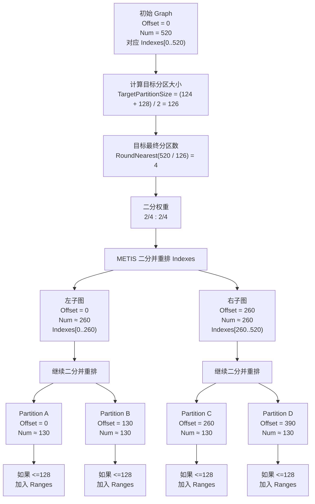

- [1. 离线构建：Nanite Pages](#1-离线构建nanite-pages)
  - [1.1. 构建 Leaf Cluster](#11-构建-leaf-cluster)
    - [1.1.1. 为每条有向 Triangle Edge 建 Hash](#111-为每条有向-triangle-edge-建-hash)
    - [1.1.2. 找共享边并建立三角形邻接信息](#112-找共享边并建立三角形邻接信息)
    - [1.1.3. 构建 Triangle 连通岛](#113-构建-triangle-连通岛)
    - [1.1.4. METIS 递归二分所有 Triangle](#114-metis-递归二分所有-triangle)
    - [1.1.5. 根据分区结果创建 Leaf Cluster](#115-根据分区结果创建-leaf-cluster)
  - [1.2. 构建 Cluster DAG](#12-构建-cluster-dag)
    - [1.2.1. Group 怎么划分](#121-group-怎么划分)
    - [1.2.2. `Reduce` Group](#122-reduce-group)
- [3. References](#3-references)

本篇笔记是关于 Unreal Engine 中 Nanite 系统的源码分析理解，基于引擎版本 5.7.3 release

## 1. 离线构建：Nanite Pages

### 1.1. 构建 Leaf Cluster

#### 1.1.1. 为每条有向 Triangle Edge 建 Hash

在原始的 mesh 中，顶点索引数据 `Indexes` 中记录了所有三角形的 vertex index，每 3 个 vertex index 是一个三角形，Nanite 按 vertex index 取每条有向三角形边，`EdgeIndex` 实际就是 `Indexes` 中的每个 vertex index，后续在 mesh 简化的源代码中，`CornerIndex` 也是每个 vertex index。

第一步要做的，就是**并行遍历每条有向三角形边并根据每条边的 2 个端点位置计算它的 hash**。

**需要注意的是**： Nanite 中是根据**有向三角形边的 2 个端点的位置**来计算其 hash，而不是根据 vertex index 来计算。这是因为 mesh 可能由于 UV seam/normal seam/hard edge 等原因把同一个位置拆成多个顶点，通过位置来计算 hash 可以保证只要位置能匹配，就能在后续处理的过程中被识别为几何相邻。

同一个位置被拆成多个顶点的一个很典型的例子：一个立方体只有 8 个角点位置，但渲染时常常不是 8 个顶点，而是 24 个顶点，这是因为每个角会被 3 个面使用，而每个面都要有自己的法线、UV。

`Cycle3` 函数在三角形 3 个顶点内循环 + 1，对于任意传入的 `EdgeIndex`（有向三角形边 `EdgeIndex` 的起点），次函数返回此有向三角形边的终点：

```c++
FORCEINLINE uint32 Cycle3( uint32 Value )
{
    uint32 ValueMod3 = Value % 3;
    uint32 Value1Mod3 = ( 1 << ValueMod3 ) & 3;
    return Value - ValueMod3 + Value1Mod3;
}
```

对于有向三角形边 EdgeIndex，分别取其 2 个端点的位置 `Position0` 和 `Position1`，以 `(Position0, Position1)` 顺序计算这条有向三角形边的 hash，最后将结果添加到 `FEdgeHash::HashTable` 中，其中 Key 是有向三角形边 EdgeIndex 的 hash，Value 是有向三角形边的索引 EdgeIndex ：

```c++
template< typename FGetPosition >
void Add_Concurrent( int32 EdgeIndex, FGetPosition&& GetPosition )
{
    // 有向三角形边 EdgeIndex 的起点位置
    const FVector3f& Position0 = GetPosition( EdgeIndex );
    // 有向三角形边 EdgeIndex 的终点位置
    const FVector3f& Position1 = GetPosition( Cycle3( EdgeIndex ) );

    // 以 { HashPosition( Position0 ), HashPosition( Position1 ) } 的顺序计算 hash
    uint32 Hash0 = HashPosition( Position0 );
    uint32 Hash1 = HashPosition( Position1 );
    uint32 Hash = Murmur32( { Hash0, Hash1 } );

    // 添加到 HashTable 中: key=hash, value=EdgeIndex
    HashTable.Add_Concurrent( Hash, EdgeIndex );
}
```

#### 1.1.2. 找共享边并建立三角形邻接信息

所谓的共享边，指的是两条有向三角形边满足：**顶点位置相同，方向相反**，如下所示：

```c++
// Find edge with opposite direction that shares these 2 verts.
/*
      /\
     /  \
    o-<<-o
    o->>-o
     \  /
      \/
*/
```

在上一步为每条有向三角形边建 hash 时是以 `(Position0, Position1)` 的顺序来计算，而这一步则以相反的顺序 `(Position1, Position0)` 来查找**共享边**：

```c++
template< typename FGetPosition, typename FuncType >
void ForAllMatching( int32 EdgeIndex, bool bAdd, FGetPosition&& GetPosition, FuncType&& Function )
{
    const FVector3f& Position0 = GetPosition( EdgeIndex );
    const FVector3f& Position1 = GetPosition( Cycle3( EdgeIndex ) );

    uint32 Hash0 = HashPosition( Position0 );
    uint32 Hash1 = HashPosition( Position1 );

    // 以 { HashPosition( Position1 ), HashPosition( Position0 ) } 的顺序来计算共享边的 hash
    uint32 Hash = Murmur32( { Hash1, Hash0 } );

    for( uint32 OtherEdgeIndex = HashTable.First( Hash ); HashTable.IsValid( OtherEdgeIndex ); OtherEdgeIndex = HashTable.Next( OtherEdgeIndex ) )
    {
        if( Position0 == GetPosition( Cycle3( OtherEdgeIndex ) ) &&
            Position1 == GetPosition( OtherEdgeIndex ) )
        {
            // Found matching edge.
            Function( EdgeIndex, OtherEdgeIndex );
        }
    }

    if( bAdd )
        HashTable.Add( Murmur32( { Hash0, Hash1 } ), EdgeIndex );
}
```

通过 `FEdgeHash::HashTable` 查找每条有向三角形边的共享边，并将其共享边数量写入 `FAdjacency::Direct` ：

```c++
// 并行遍历所有有向三角形边
ParallelFor( TEXT("Nanite.ClusterTriangles.PF"), Indexes.Num(), 1024,
    [&]( int32 EdgeIndex )
    {
        int32 AdjIndex = -1;
        int32 AdjCount = 0;
        // 找这条有向三角形边的共享边
        EdgeHash.ForAllMatching( EdgeIndex, false, GetPosition,
            [&]( int32 EdgeIndex, int32 OtherEdgeIndex )
            {
                // 记录找到的共享边的索引 EdgeIndex
                AdjIndex = OtherEdgeIndex;
                AdjCount++;
            } );

        // 找到的共享边数量超过 1 个, 赋值为 -2
        if( AdjCount > 1 )
            AdjIndex = -2;

        // 
        Adjacency.Direct[ EdgeIndex ] = AdjIndex;
    } );
```

最终 `FAdjacency::Direct` 中记录了 **3 种情况**：

1. `FAdjacency::Direct[ EdgeIndex ] = -1`：有向三角形边 EdgeIndex **没有**邻接的共享边，说明它是边界
2. `FAdjacency::Direct[ EdgeIndex ] >= 0`：有向三角形边 EdgeIndex **有唯一**邻接的共享边，也就是说这条边被 2 个三角形共享，这种边叫做流形（Manifold）边，有向三角形边大多数情况下都是流形边
3. `FAdjacency::Direct[ EdgeIndex ] = -2`：有向三角形边 EdgeIndex **有多个**邻接的共享边，也就是说这条边被超过 2 个三角形共享，这种边叫做非流形边，这是一种特殊情况

对于非流形边，需要进行**额外的处理**：

非流形边有多个（>= 2）共享边，所以先找出其所有的共享边，然后再将找到的共享边按 vertex index **排序**，最后再将非流形边的邻接共享边信息写入 `FAdjacency::Extended` 中，`FAdjacency::Extended` 本质上是允许重复 Key 的 `TMap`，记录了非流形有向三角形边的所有共享边的 EdgeIndex。

**注意**：按 vertex index 排序的操作是很重要的：因为 EdgeHash 是并行构建的，所以 `FEdgeHash::HashTable` 中元素的顺序是不固定的，先按照 vertex index 进行排序可以保证**构建结果的确定性（Determinism）**。

```c++
// 额外处理非流形边
if( Adjacency.Direct[ EdgeIndex ] == -2 )
{
    // 先找出所有共享边
    TArray< TPair< int32, int32 >, TInlineAllocator< 16 > > Edges;
    EdgeHash.ForAllMatching( EdgeIndex, false, GetPosition,
        [&]( int32 EdgeIndex0, int32 EdgeIndex1 )
        {
            Edges.Emplace( EdgeIndex0, EdgeIndex1 );
        } );

    // 然后按 vertex index 排序, 保证结果的确定性
    Edges.Sort();

    // 最后写入 Adjacency.Extended
    for( const TPair< int32, int32 >& Edge : Edges )
    {
        Adjacency.Link( Edge.Key, Edge.Value );
    }
}
```

到这里，我们知道了每条有向三角形边的共享边信息，也就是说：**对于任意有向三角形边，我们可以根据其共享边信息而知道它被哪几个三角形共享**，同样的：**对于任意三角形，我们同样可以根据其三条边的共享边信息而得到它与其它哪些三角形之间是否存在共享边**。

#### 1.1.3. 构建 Triangle 连通岛

所谓的三角形连通岛，是**把每个三角形看成图上的一个节点，如果两个三角形在几何上共享同一条边，就在它们之间建立邻接关系；沿着这些邻接关系可以互相到达的一组三角形，就构成一个连通岛**。

Nanite 通过上一步构建的 `FAdjacency` 数据构建一个 `FDisjointSet`，把通过共享边相连通的三角形合并成连通岛。

```c++
inline void FDisjointSet::Init( uint32 Size )
{
    Parents.SetNumUninitialized( Size, EAllowShrinking::No);
    for( uint32 i = 0; i < Size; i++ )
    {
        Parents[i] = i;
    }
}
```

初始化 `FDisjointSet` 时，一共 `Size` 个三角形每个自成一个连通岛，也就是说，每个连通岛的根节点都是每个三角形自己 `Parents[i] = i`

```c++
template< typename FuncType >
void ForAll( int32 EdgeIndex, FuncType&& Function ) const
{
    int32 AdjIndex = Direct[ EdgeIndex ];
    if( AdjIndex >= 0 )
    {
        Function( EdgeIndex, AdjIndex );
    }

    for( auto Iter = Extended.CreateConstKeyIterator( EdgeIndex ); Iter; ++Iter )
    {
        Function( EdgeIndex, Iter.Value() );
    }
}

// 遍历每条有向三角形边的所有共享边
Adjacency.ForAll( EdgeIndex,
    [&]( int32 EdgeIndex0, int32 EdgeIndex1 )
    {
        // 根据 EdgeIndex / 3 计算得到所属的三角形 index
        // 将存在共享边的 2 个三角形 union 到同一个连通岛
        if( EdgeIndex0 > EdgeIndex1 )
            DisjointSet.UnionSequential( EdgeIndex0 / 3, EdgeIndex1 / 3 );
    } );
```

遍历每条有向三角形边，获取它们所有的共享边，根据 `EdgeIndex / 3` 计算出其所属的三角形，并将这些存在共享边的三角形合并（Union）到同一个连通岛，合并时**会让父节点编号较小的一侧逐步挂到父节点编号较大的一侧，这里的编号指的是三角形 index**

```c++
// Union with splicing
inline void FDisjointSet::Union( uint32 x, uint32 y )
{
    uint32 px = Parents[x];     // x 的父节点 px
    uint32 py = Parents[y];     // y 的父节点 py

    while( px != py )           // x 的父节点与 y 的父节点不同, 进行合并
    {
                                // 始终将父节点编号较小的一侧合并到父节点编号较大的一侧
        if( px < py )           // px 更小
        {
            Parents[x] = py;    // x 的父节点直接设置为 py
            if( x == px )       // x 的父节点就是 x 本身, 则说明 x 所在的连通岛上所有节点已经合并完成
            {
                return;
            }
            x = px;             // 继续往上合并 x 的父节点
            px = Parents[x];
        }
        else                    // py 更小, 则反之
        {
            Parents[y] = px;
            if( y == py )
            {
                return;
            }
            y = py;
            py = Parents[y];
        }
    }
}
```

- `DisjointSet::Union()` 方法核心的逻辑就是：从 `x` 和 `y` 各自当前的父节点 `px`、`py` 开始，沿着两边的父链向根节点推进，每一步都把父节点编号较小的一侧挂到编号较大的一侧，如果被挂接的节点已经是该侧的根节点，则表示合并完成。另外 UE 还提供了一个特化版本的合并方法 `FDisjointSet::UnionSequential()`，使用这个方法有一定的前提（x 本身是根节点并且 x >= y），当然这个方法合并也更效率，Nanite 构建三角形连通岛时，使用的就是此方法。

```c++
// Find with path compression
inline uint32 FDisjointSet::Find( uint32 i )
{
    // 找到节点 i 所在连通岛的根节点 Root
    uint32 Start = i;
    uint32 Root = Parents[i];
    while( Root != i )
    {
        i = Root;
        Root = Parents[i];
    }

    // 路径压缩: 并且把 i 到 Root 之间的所有节点的父节点都设置为 Root
    i = Start;
    uint32 Parent = Parents[i];
    while( Parent != Root )
    {
        Parents[i] = Root;
        i = Parent;
        Parent = Parents[i];
    }

    return Root;
}
```

- `FDisjointSet::Find()` 方法用于查找某个节点的根节点 `Root`，并且还会**压缩路径：将节点 i 到 i 的根节点 Root 之间的所有节点的父节点都设置为 i 的根节点 Root**，这样后续再查找此路径上任意节点的根节点时，只需要一次内存访问即可。

#### 1.1.4. METIS 递归二分所有 Triangle

有了三角形的连通信息，下面要做的就是对所有的三角形进行**分区（Partition）**：

首先构建三角形图（Triangle Graph），每个三角形是图中的一个节点，节点与节点之间的边有两类：第一类是**拓扑邻接**，第二类是**空间局部性邻接**，最后使用 METIS 递归二分图，直到每个分区图不超过 128 个节点，也就是 128 个三角形。

Nanite 中一个 cluster 包含 128 个三角形（`FCluster::ClusterSize=128`），在划分时每个分区三角形的目标大小是 `124 ～ 128` ：

```c++
FGraphPartitioner Partitioner( NumTriangles, FCluster::ClusterSize - 4, FCluster::ClusterSize );
```

所谓的拓扑邻接，指的是 2 个三角形有真实的共享边，拓扑邻接关系我们可以通过共享边获取；而空间局部性邻接则指的是 2 个三角形在真实 3D 空间上邻近，Nanite 通过 `FGraphPartitioner::BuildLocalityLinks()` 方法建立部分三角形弱空间局部性邻接信息：

先说说 **Morton 编码**，它又叫做 **Z-order Curve** 或 **Z 值编码**，Morton 编码有一个很重要的性质： **3D 空间上接近的点，其 Morton 编码也接近**，也就是说： **3D 空间上的邻居对应排序后 Morton 数组中的邻居**

Nanite 第一步做的，是计算所有三角形的空间局部顺序：计算每个三角形中心点在模型空间的 3D 坐标并归一化到模型空间 AABB 中，然后计算其对应的 Morton 编码，最后根据 Morton 编码排序所有三角形：

```c++
auto GetCenter = [ &Verts, &Indexes ]( uint32 TriIndex )
{
    FVector3f Center;
    Center  = Verts.Position[ Indexes[ TriIndex * 3 + 0 ] ];
    Center += Verts.Position[ Indexes[ TriIndex * 3 + 1 ] ];
    Center += Verts.Position[ Indexes[ TriIndex * 3 + 2 ] ];
    return Center * (1.0f / 3.0f);
};

ParallelFor( TEXT("BuildLocalityLinks.PF"), NumElements, 4096,
    [&]( uint32 Index )
    {
        // 获取三角形中心点坐标
        FVector3f Center = GetCenter( Index );
        // 归一化到 mesh AABB
        FVector3f CenterLocal = ( Center - Bounds.Min ) / FVector3f( Bounds.Max - Bounds.Min ).GetMax();

        // 计算 Morton 编码
        uint32 Morton;
        Morton  = FMath::MortonCode3( uint32( CenterLocal.X * 1023 ) );
        Morton |= FMath::MortonCode3( uint32( CenterLocal.Y * 1023 ) ) << 1;
        Morton |= FMath::MortonCode3( uint32( CenterLocal.Z * 1023 ) ) << 2;
        SortKeys[ Index ] = Morton;
    } );

// 根据 Morton 编码排序所有三角形
RadixSort32( SortedTo.GetData(), Indexes.GetData(), NumElements,
    [&]( uint32 Index )
    {
        return SortKeys[ Index ];
    } );

SortKeys.Empty();

// Swap 之后, Indexes 中是排序后的三角形 index
Swap( Indexes, SortedTo );
// 建立映射数组, SortedTo 中记录了原始三角形 index 到排序后位置的映射
for( uint32 i = 0; i < NumElements; i++ )
{
    SortedTo[ Indexes[i] ] = i;
}
```

按 Morton 编码排序之后，`FGraphPartitioner::Indexes` 中记录了排序后的三角形 index 列表，而 `FGraphPartitioner::SortedTo` 中记录了原始三角形 index 到排序后位置的反向映射，也就是给定一个三角形原始 index，可以通过 `FGraphPartitioner::SortedTo` 快速得到它在当前排序序列中的位置

第二步，在已经按 Morton 编码排序的 `Indexes` 中，记录**连续属于同一个连通岛的三角形元素区间**：

```c++
TArray< FRange > IslandRuns;
IslandRuns.AddUninitialized( NumElements );

// Run length acceleration
// Range of identical IslandID denoting that elements are connected.
// Used for jumping past connected elements to the next nearby disjoint element.
{
    uint32 RunIslandID = 0;
    uint32 RunFirstElement = 0;

    // 遍历排序后的 Indexes
    for( uint32 i = 0; i < NumElements; i++ )
    {
        // 获取三角形所在的连通岛 ID
        uint32 IslandID = DisjointSet.Find( Indexes[i] );

        // 一个新的连通岛区间
        if( RunIslandID != IslandID )
        {
            // 将属于上一个连通岛区间的所有元素的 End 设置为新的连通岛区间的起始元素索引
            for( uint32 j = RunFirstElement; j < i; j++ )
            {
                IslandRuns[j].End = i;
            }
        
            // 记录当前的连通岛 ID
            RunIslandID = IslandID;
            // 当前连通岛 ID 的起始元素索引
            RunFirstElement = i;
        }

        // 如果仍然在同一个连通岛区间, 每个元素的 Begin 都是当前连通岛 ID 的起始元素索引
        IslandRuns[i].Begin = RunFirstElement;
    }
    // Finish the last run
    for( uint32 j = RunFirstElement; j < NumElements; j++ )
    {
        IslandRuns[j].End = NumElements;
    }
}
```

Nanite 根据连通岛信息，在排好序后的 `Indexes` 上构建 `IslandRuns`，记录每个三角形元素所在的**连续相同连通岛区间**。这样做的核心目的有 2 个：

- 避免给同一个连通岛内部的三角形再构建空间局部邻接信息
- 遇到同一连通岛的连续区间时，可以整段跳过，从而加速空间局部邻接信息的搜索和构建

最后一步，也就是构建空间局部邻接信息：

```c++
for( uint32 i = 0; i < NumElements; i++ )
{
    // 原始三角形 index
    uint32 Index = Indexes[i];

    uint32 RunLength = IslandRuns[i].Num();
    // 只有三角形所在的连续连通岛区间少于 128 个三角形时, 才为其构建空间局部邻接信息
    if( RunLength < 128 )
    {
        // 当前三角形所属的连通岛 ID
        uint32 IslandID = DisjointSet[ Index ];
        // 当前元素所属的 GroupID , 这里的 GroupIndexes 是 mesh 的材质数组 MaterialIndexes, 所以这里的 GroupID 指的是材质 ID
        int32 GroupID = bElementGroups ? GroupIndexes[ Index ] : 0;

        // 当前三角形中心 3D 坐标
        FVector3f Center = GetCenter( Index );

        // 为当前三角形寻找最多 5 个空间局部邻接三角形
        const uint32 MaxLinksPerElement = 5;

        // 记录邻接三角形 index
        uint32 ClosestIndex[MaxLinksPerElement];
        // 记录当前三角形与邻接三角形的距离平方
        float  ClosestDist2[MaxLinksPerElement];
        for (int32 k = 0; k < MaxLinksPerElement; k++)
        {
            ClosestIndex[k] = ~0u;
            ClosestDist2[k] = MAX_flt;
        }

        // 分别向按 Morton 编码排好序后的 Indexes 前后两个方向搜索
        for( int Direction = 0; Direction < 2; Direction++ )
        {
            uint32 Limit = Direction ? NumElements - 1 : 0;
            uint32 Step  = Direction ? 1 : -1;

            uint32 Adj = i;
            // 每个方向最多迭代 16 次
            for( int32 Iterations = 0; Iterations < 16; Iterations++ )
            {
                // 到 Indexes 边界, 跳出查找
                if( Adj == Limit )
                    break;
                Adj += Step;

                uint32 AdjIndex = Indexes[ Adj ];
                uint32 AdjIslandID = DisjointSet[ AdjIndex ];
                int32 AdjGroupID = bElementGroups ? GroupIndexes[AdjIndex] : 0;
                // 跳过属于相同连通岛或使用不同材质的三角形
                if( IslandID == AdjIslandID || ( GroupID != AdjGroupID ) )
                {
                    // Skip past this run
                    if( Direction )
                        Adj = IslandRuns[ Adj ].End - 1;
                    else
                        Adj = IslandRuns[ Adj ].Begin;
                }
                else
                {
                    // Add to sorted list
                    // 计算实际距离平方
                    float AdjDist2 = ( Center - GetCenter( AdjIndex ) ).SizeSquared();
                    // 使用插入排序写入有序列表
                    for( int k = 0; k < MaxLinksPerElement; k++ )
                    {
                        if( AdjDist2 < ClosestDist2[k] )
                        {
                            Swap( AdjIndex, ClosestIndex[k] );
                            Swap( AdjDist2, ClosestDist2[k] );
                        }
                    }
                }
            }
        }

        // 建立双向空间局部邻接信息
        for( int k = 0; k < MaxLinksPerElement; k++ )
        {
            if( ClosestIndex[k] != ~0u )
            {
                // Add both directions
                LocalityLinks.AddUnique( Index, ClosestIndex[k] );
                LocalityLinks.AddUnique( ClosestIndex[k], Index );
            }
        }
    }
}
```

对于按 Morton 编码排好序的三角形 `Indexes`，Nanite **只会为属于较小连续连通岛区间内的三角形构建空间局部邻接信息**，也就是该区间内的三角形数量小于 128。对于这些三角形，会沿排好序后的 `Indexes` 向前、后两个方向各最多执行 16 次搜索迭代，搜索过程中会**跳过同连通岛 ID 或不同分组 ID （在这里，不同分组 ID 指的是不同材质 ID）**的连续区间，从剩余候选中按**实际 3D 空间距离选出最多 5 个**最近三角形，并构建双向的空间局部邻接关系。

从这里可以看出，Nanite 在构建空间局部邻接信息时，会尝试在**3D 空间上接近、材质相同，但不属于同一几何连通块的三角形之间建立空间局部邻接关系**。

最后，Nanite 根据前面得到的两类邻接信息，构建 METIS 使用的图结构，并进行递归二分：

```c++
auto* RESTRICT Graph = Partitioner.NewGraph( NumTriangles * 3 );

for( uint32 i = 0; i < NumTriangles; i++ )
{
    Graph->AdjacencyOffset[i] = Graph->Adjacency.Num();

    // 按 Partitioner.Indexes 的顺序遍历三角形
    uint32 TriIndex = Partitioner.Indexes[i];

    // 拓扑邻接, 高权重 260, Nanite 强烈倾向将共享真实几何边的三角形分到同一个分区
    for( int k = 0; k < 3; k++ )
    {
        Adjacency.ForAll( 3 * TriIndex + k,
            [ &Partitioner, Graph ]( int32 EdgeIndex, int32 AdjIndex )
            {
                Partitioner.AddAdjacency( Graph, AdjIndex / 3, 4 * 65 );
            } );
    }

    // 空间局部邻接, 极低权重 1
    Partitioner.AddLocalityLinks( Graph, TriIndex, 1 );
}
Graph->AdjacencyOffset[ NumTriangles ] = Graph->Adjacency.Num();

bool bSingleThreaded = NumTriangles < 5000;

// 递归二分
Partitioner.PartitionStrict( Graph, !bSingleThreaded );
check( Partitioner.Ranges.Num() );
```

在构建 METIS 使用的图结构时，是按 `Partitioner.Indexes` 中的顺序遍历三角形，也就是说： **METIS 图中的节点 i 表示的是按 Morton 编码排序后的三角形 Indexes[i]，而不是原始三角形 i**，所以**后续所有邻接三角形的原始 index 都要通过 `FGraphPartitioner::SortedTo` 转换成排好序后的 index**。在 `FGraphPartitioner::AddAdjacency` 和 `FGraphPartitioner::AddLocalityLinks` 方法中都有 `SortedTo[ AdjIndex ]` 转换的操作。

图节点之间，先通过共享边信息添加拓扑邻接权重，拓扑邻接的权重是 `260`，说明 **Nanite 强烈倾向将共享真实几何边的三角形划分在同一个分区**；再通过空间局部邻接信息添加空间局部邻接权重，空间局部邻接的权重是 `1`，远远低于拓扑邻接的权重，说明 Nanite 希望**3D 空间上靠近的三角形，尽量别分太远，但如果和拓扑邻接冲突，则拓扑邻接的优先级要高得多**。

这里简单介绍一下 METIS ：

METIS 是一个用于**图划分、有限元网格划分、稀疏矩阵重排序**的库，这里有一个关于怎么使用 METIS 库进行图划分的文章[使用 METIS 软件包进行图划分](https://www.jianshu.com/p/55e6b6897057)。另外，关于 METIS 的控制参数 `Options[ METIS_OPTION_UFACTOR ]`，它用于控制划分后子分区之间允许的不平衡程度（以千分之一为单位），简单来说：就是划分后每个子分区多可以比“理想大小”大多少。假设一个图一共有 N 个节点，要将其划分为 `k` 个子分区，那么理想情况下，每个子分区应该包含 `N/k` 个节点，如果 `Options[ METIS_OPTION_UFACTOR ] = 20`，那么每个子分区最多比理想大小多 2%（20/1000=0.02）的节点数

具体递归二分划分的代码在这里就不详细展开讲了，主要的逻辑如下：

- 首先，图中的节点表示的是 `Partitioner.Indexes` 中一个连续区间中的元素，`Graph->Offset` 记录连续区间的起点，`Graph->Num` 记录了连续区间中的元素数量
- 每次二分时，会把当前图的目标分区大小设置为 `(MinPartitionSize + MaxPartitionSize) / 2`，在构建 leaf cluster 时，这个值是 `(124 + 128) / 2 = 126`
- 计算当前图的目标最终分区数： `Max(2, DivideAndRoundNearest(Graph->Num, TargetPartitionSize))`
- 根据这个目标分区数给二分两侧设置权重（例如目标 5 个分区时，权重是 `2/5` 和 `3/5`）
- 调用 `METIS_PartGraphRecursive` 把当前图二分，根据划分结果原地重排序（插入排序）这个连续区间，使被划分到不同分区的元素分别处于这个连续分区的两侧，也就是说：**将一个连续区间划分为两个子连续区间**
- 划分后的两个子连续区间如果大小都小于 `MaxPartitionSize`，则直接把这两个子连续区间当作最终分区添加进 `Partitioner.Ranges` 中；否则继续为这两个子连续区间分别构建子图，并继续二分这两个子连续区间
- 如果要被划分的图中的节点数量小于 `MaxPartitionSize`，则直接把整个图代表的连续区间当作一个最终分区添加进 `Partitioner.Ranges` 中，并跳出递归二分

最后画一个递归二分的图来帮助理解：



最终的分区结果存储在 `Partitioner.Ranges` 中，它记录了**经历了多次二分和原地重排序后的 `Partitioner.Indexes` 数组中的连续区间**，每个元素 `FRange` 表示一个分区在 `Partitioner.Indexes` 中的范围，`FRange::Begin` 是分区起点，`FRange::End` 是分区终点，`FRange::Num` 是这个分区里面三角形元素的数量。

#### 1.1.5. 根据分区结果创建 Leaf Cluster

<!-- 另外，由于原 `Partitioner.Indexes` 是根据 Morton 编码排好序后的三角形 index 数组，所以真正的原始三角形 index 还需要通过 `Partitioner.Indexes[Begin..End]` 获取。 -->

根据 `Partitioner.Ranges` 中的每个 `FRange` 元素创建所有的 leaf cluster：

```c++
{
    TRACE_CPUPROFILER_EVENT_SCOPE(Nanite::Build::BuildClusters);
    ParallelFor( TEXT("Nanite.BuildClusters.PF"), Partitioner.Ranges.Num(), 1024,
        [&]( int32 Index )
        {
            auto& Range = Partitioner.Ranges[ Index ];

            uint32 ClusterIndex = BaseCluster + Index;

            Clusters[ ClusterIndex ] = FCluster(
                Verts,
                Indexes,
                MaterialIndexes,
                VertexFormat,
                Range.Begin, Range.End,
                Partitioner.Indexes, Partitioner.SortedTo, Adjacency );

            // Negative notes it's a leaf
            Clusters[ ClusterIndex ].EdgeLength *= -1.0f;

            MeshInput[ MeshIndex ][ Index ] = FClusterRef( ClusterIndex );
        });
}
```

由于 `FRange` 中记录的是 `Partitioner.Indexes` 中的某个连续区间，而 `Partitioner.Indexes` 又是**根据 Morton 编码排序后**的三角形 index 数组，所以要先通过 `SortedIndexes[i]` 转换为原始 mesh 中的三角形 index，然后根据此三角形 index 再去读取原始 mesh 中每个顶点的属性并构建 cluster 内部的基础 mesh 信息。

```c++
for( uint32 i = Begin; i < End; i++ )
{
    // Begin/End 是 Partitioner.Indexes 中某个连续区间的起始/终点, 通过 SortedIndexes[i] 转换为原始 mesh 中的三角形 index
    uint32 TriIndex = SortedIndexes[i];

    ...
}
```

创建 leaf cluster 时，首先会构建 cluster 的基础 mesh 数据：

```c++
// 原始 mesh 中每个三角形的顶点索引
uint32 OldIndex = InIndexes[ TriIndex * 3 + k ];

// 是否已经添加过此顶点
//   - 添加过: 只需要向 Indexes 中新增此顶点的索引
//   - 没有添加过: 向 Verts 中添加一个新的局部顶点, 并拷贝相关顶点属性, 最后向 Indexes 中新增此顶点的索引
uint32* NewIndexPtr = OldToNewIndex.Find( OldIndex );
uint32 NewIndex = NewIndexPtr ? *NewIndexPtr : ~0u;

// 没有添加过
if( NewIndex == ~0u )
{
    // 向 Verts 添加一个新的局部顶点
    NewIndex = Verts.AddUninitialized();
    // 建立原始 mesh 顶点索引到 cluster 局部顶点索引的映射
    OldToNewIndex.Add( OldIndex, NewIndex );

    // 拷贝 position, normal 顶点属性
    Verts.GetPosition( NewIndex ) = InVerts.Position[OldIndex];
    Verts.GetNormal( NewIndex ) = InVerts.TangentZ[OldIndex];

    // 拷贝 tangent, tangent sign 顶点属性
    if( Verts.Format.bHasTangents )
    {
        const float TangentYSign = ((InVerts.TangentZ[OldIndex] ^ InVerts.TangentX[OldIndex]) | InVerts.TangentY[OldIndex]);
        Verts.GetTangentX( NewIndex ) = InVerts.TangentX[OldIndex];
        Verts.GetTangentYSign( NewIndex ) = TangentYSign < 0.0f ? -1.0f : 1.0f;
    }

    // 拷贝 color 顶点属性
    if( Verts.Format.bHasColors )
    {
        Verts.GetColor( NewIndex ) = InVerts.Color[OldIndex].ReinterpretAsLinear();
    }

    // 拷贝 UV 顶点属性
    if( Verts.Format.NumTexCoords > 0 )
    {
        FVector2f* UVs = Verts.GetUVs( NewIndex );
        for( uint32 UVIndex = 0; UVIndex < Verts.Format.NumTexCoords; UVIndex++ )
        {
            UVs[UVIndex] = InVerts.UVs[UVIndex][OldIndex];
        }
    }

    // 拷贝 bone index/bone weight 顶点属性
    if( Verts.Format.NumBoneInfluences > 0 )
    {
        FVector2f* BoneInfluences = Verts.GetBoneInfluences(NewIndex);
        for (uint32 Influence = 0; Influence < Verts.Format.NumBoneInfluences; Influence++)
        {
            BoneInfluences[Influence].X = InVerts.BoneIndices[Influence][OldIndex];
            BoneInfluences[Influence].Y = InVerts.BoneWeights[Influence][OldIndex];
        }
    }
}

// 向局部 Indexes 中添加此顶点索引
Indexes.Add( NewIndex );

...

// 拷贝原始 mesh 中三角形的材质索引, 并添加到 cluster 局部三角形材质索引 MaterialIndexes 中
MaterialIndexes.Add( InMaterialIndexes[ TriIndex ] );
```

然后还会构建 cluster 与其它 clutser 之间的拓扑邻接信息：

```c++
// 取每条有向三角形边
int32 EdgeIndex = TriIndex * 3 + k;
int32 AdjCount = 0;

// 找此有向三角形边在原 mesh 中的共享边
Adjacency.ForAll( EdgeIndex,
    [ &AdjCount, Begin, End, &SortedTo ]( int32 EdgeIndex, int32 AdjIndex )
    {
        // AdjIndex / 3 得到邻接三角形原始 index, 再通过 SortedTo[ AdjIndex / 3 ] 转换到按 Morton 编码排序后的 SortedIndexes 中的 index
        uint32 AdjTri = SortedTo[ AdjIndex / 3 ];
        // 确认这个邻接三角形在不在当前 Cluster 的 [Begin, End) 区间中, 如果不在则表明此邻接三角形属于另一个 Cluster, 也就是说明这条有向三角形边与其它 Cluster 邻接, 是它所在 Cluster 的边界
        if( AdjTri < Begin || AdjTri >= End )
            AdjCount++;
    } );

// 记录当前 Cluster 内这条有向三角形边是否与其它 Cluster 邻接, AdjCount == 0 说明这条边是 Cluster 内部边, AdjCount > 0 说明这条边是 Cluster 的边界 (与其它 Cluster 邻接)
ExternalEdges.Add( (int8)AdjCount );
// 累积所有边界边的数量
NumExternalEdges += AdjCount != 0 ? 1 : 0;
```

`ExternalEdges` 中的每个 `int8` 元素记录 cluster 中一条有向三角形边的**外部邻接边数量**：值为 0 表示该边没有连接到 cluster 外部的邻接三角形；值大于 0 表示该边与 cluster 外部的三角形邻接，因此是 cluster 边界边。而 `NumExternalEdges` 记录了 cluster 中边界边的总数量。

最后还会计算 cluster 的包围盒等信息：

```c++
// 计算 Cluster 的 AABB
for( uint32 i = 0; i < Verts.Num(); i++ )
{
    Positions[i] = Verts.GetPosition(i);
    Bounds += Positions[i];
}
// 计算 Cluster 的 SphereBounds
SphereBounds = FSphere3f( Positions.GetData(), Positions.Num() );
LODBounds = SphereBounds;

float MaxEdgeLength2 = 0.0f;
for( int i = 0; i < Indexes.Num(); i += 3 )
{
    // Cluster 的每个三角形
    FVector3f v[3];
    v[0] = Verts.GetPosition( Indexes[ i + 0 ] );
    v[1] = Verts.GetPosition( Indexes[ i + 1 ] );
    v[2] = Verts.GetPosition( Indexes[ i + 2 ] );

    // 每条有向三角形边
    FVector3f Edge01 = v[1] - v[0];
    FVector3f Edge12 = v[2] - v[1];
    FVector3f Edge20 = v[0] - v[2];

    // 更新最长边的平方
    MaxEdgeLength2 = FMath::Max( MaxEdgeLength2, Edge01.SizeSquared() );
    MaxEdgeLength2 = FMath::Max( MaxEdgeLength2, Edge12.SizeSquared() );
    MaxEdgeLength2 = FMath::Max( MaxEdgeLength2, Edge20.SizeSquared() );

    // 三角形的面积: ^ 是叉乘, |a x b| = 平行四边形面积, 所以三角形 Mesh 的面积 = 0.5 * 平行四边形面积
    float TriArea = 0.5f * ( Edge01 ^ Edge20 ).Size();
    // 累计 Cluster 内所有三角形面积和
    SurfaceArea += TriArea;
}
// 记录 Cluster 内最大三角形边长
EdgeLength = FMath::Sqrt( MaxEdgeLength2 );
```

其中，`Bounds` 是 cluster 的 AABB；包围球 `SphereBounds`；LOD 包围范围 `LODBounds`，在 leaf cluster 中其初始为 `LODBounds = SphereBounds`；以及 cluster 中所有三角形的面积和 `SurfaceArea` 与 cluster 中所有三角形中最长的边的边长 `EdgeLength`

另外，Nanite 通过**Ritter 包围球算法（Ritter’s Bounding Sphere Algorithm）**计算 cluster 的包围球 `SphereBounds`，在这里额外贴一下 Ritter 包围球算法的代码：

```c++
// [ Ritter 1990, "An Efficient Bounding Sphere" ]
template<typename T>
static FORCEINLINE void ConstructFromPoints(TSphere<T>& ThisSphere, const TVector<T>* Points, int32 Count)
{
    check(Count > 0);

    // Min/max points of AABB
    // 1. 找 AABB 的三个轴的极点值
    int32 MinIndex[3] = { 0, 0, 0 };    // { X 轴最小, Y 轴最小, Z 轴最小 }
    int32 MaxIndex[3] = { 0, 0, 0 };    // { X 轴最大, Y 轴最大, Z 轴最大 }

    for (int i = 0; i < Count; i++)
    {
        for (int k = 0; k < 3; k++)
        {
            MinIndex[k] = Points[i][k] < Points[MinIndex[k]][k] ? i : MinIndex[k];
            MaxIndex[k] = Points[i][k] > Points[MaxIndex[k]][k] ? i : MaxIndex[k];
        }
    }

    // 2. 找跨度最大的轴
    T LargestDistSqr = 0.0f;
    int32 LargestAxis = 0;
    for (int k = 0; k < 3; k++)
    {
        TVector<T> PointMin = Points[MinIndex[k]];
        TVector<T> PointMax = Points[MaxIndex[k]];

        T DistSqr = (PointMax - PointMin).SizeSquared();
        if (DistSqr > LargestDistSqr)
        {
            LargestDistSqr = DistSqr;
            LargestAxis = k;
        }
    }

    // 3. 用最远的两点初始化球, 此时球正好包住这两个极端点, 但可能还包不住其它点
    TVector<T> PointMin = Points[MinIndex[LargestAxis]];
    TVector<T> PointMax = Points[MaxIndex[LargestAxis]];

    ThisSphere.Center = 0.5f * (PointMin + PointMax);
    ThisSphere.W = 0.5f * FMath::Sqrt(LargestDistSqr);
    T WSqr = ThisSphere.W * ThisSphere.W;

    // Adjust to fit all points
    // 扩张包围球以包住所有点
    for (int i = 0; i < Count; i++)
    {
        T DistSqr = (Points[i] - ThisSphere.Center).SizeSquared();

        if (DistSqr > WSqr)
        {
            // **Ritter 算法核心**: 扩大并移动球心以包住该点
            T Dist = FMath::Sqrt(DistSqr);
            T t = 0.5f + 0.5f * (ThisSphere.W / Dist);

            ThisSphere.Center = FMath::LerpStable(Points[i], ThisSphere.Center, t);
            ThisSphere.W = 0.5f * (ThisSphere.W + Dist);
        }
    }
}
```

到这里，Nanite 完成了 leaf cluster 的构造。而下一步要做的，就是从 leaf cluster 开始，一级一级往上构建整个 **cluster 有向无环图（Directed Acyclic Graph，DAG）**

### 1.2. 构建 Cluster DAG

在这里，引用 UE 在 SIGGRAPH 2021 中对构建 cluster DAG 流程的描述：

```text
First we need to build the leaf clusters
In our case a cluster is 128 triangles

Then for each LOD level
  - We group clusters to clean their shared boundary
  - Merge the triangles from the group into a shared list
  - Simplify to half the number of triangles
  - Then split the simplified list of triangles back into clusters

Repeat this process until there is only 1 cluster left at the root.
```

总结一下核心流程：

首先构建 leaf cluster，也就是 LOD0 的 cluster，这一步目前已经完成

然后从 LOD0 开始，重复将当前 LOD 层的 cluster 按**拓扑邻接/空间局部性邻接**划分成多个 groups，**每个 group 内的 cluster 被称为此 group 的 children cluster**，把 group 的所有 children cluster 合并成一个 **merged cluster**，然后将此 merged cluster **简化到约一半三角形数量**，最后将简化后的 merged cluster 重新切分成新的 parent cluster；这些 parent cluster 作为下一层 LOD 输入继续**重复**进行上面**划分 groups -> 合并 group 内 children cluster -> 简化 -> 切分 parent cluster**的处理；直到最终只剩一个 cluster，这个 cluster 叫做 root cluster，root cluster 单独构成一个 root group

下面展示了一个简单的流程示意图：


第一步（上图左），黄色、红色、绿色和蓝色这 4 个 leaf cluster 被划分到同一个 group 中，它们是 LOD0 层；

第二步（上图中），把这个 group 内的 4 个 children cluster 合并成一个 merged cluster 并对其进行简化；

最后（上图右），将简化后的 merged cluster 重新切分成橙色和粉红色这 2 个 parent cluster，这 2 个 parent cluster 是 LOD1 层；

可以看到，一个 group 的所有 children cluster 先合并再简化最后生成若干 parent cluster，父子之间不是传统树（tree）结构里的”一父对应多个子“或“一子只有一个父”的严格几何包含关系，而是**group 内多 children cluster 到多 parent cluster 的替代关系，生成的 parent cluster 共同替代 group 的所有 children cluster**

#### 1.2.1. Group 怎么划分

我们知道，Nanite 在构建 leaf cluster 时，会先构建原始 mesh 中三角形之间的**拓扑邻接信息**和**空间局部性邻接信息**，然后构建三角形图，图中的每个节点代表每个三角形，再根据拓扑邻接/空间局部性邻接设置图节点之间的权重，最终使用图划分库 METIS 将三角形划分到不同的 cluster。

对 cluster 划分 group 也是相似的逻辑：首先构建 cluster 之间的拓扑邻接信息和空间局部性邻接信息；然后构建 cluster 图，图中的每个节点代表每个 cluster；再根据 cluster 之间的这 2 类邻接关系设置图节点之间的权重；最后使用图划分库 METIS 将 cluster 划分到不同的 group：

先为每个 cluster 的每条边界边建 hash，并添加到边界边的 hash table 中：

```c++
// Add edges to hash table
// 首先为每个 cluster 的每条边界边建 hash, 并添加进 hash table 中
ParallelFor(TEXT("Nanite.EdgeHashAdd.PF"), LevelClusters.Num(), 32,
    [&](uint32 ClusterRefIndex)
    {
        FCluster &Cluster = LevelClusters[ClusterRefIndex].GetCluster(*this);

        for (int32 EdgeIndex = 0; EdgeIndex < Cluster.ExternalEdges.Num(); EdgeIndex++)
        {
            // 只对 cluster 的边界边建 hash
            if (Cluster.ExternalEdges[EdgeIndex])
            {
                uint32 VertIndex0 = Cluster.Indexes[EdgeIndex];
                uint32 VertIndex1 = Cluster.Indexes[Cycle3(EdgeIndex)];

                const FVector3f &Position0 = Cluster.Verts.GetPosition(VertIndex0);
                const FVector3f &Position1 = Cluster.Verts.GetPosition(VertIndex1);

                // 同样根据有向三角形边的 2 个顶点的 Position 以及固定的 Position0 -> Position1 的顺序计算 hash
                uint32 Hash0 = HashPosition(Position0);
                uint32 Hash1 = HashPosition(Position1);
                uint32 Hash = Murmur32({Hash0, Hash1});

                uint32 ExternalEdgeIndex = ExternalEdgeOffset++;
                // ExternalEdges 中记录所有边界边的 FExternalEdge 信息, FExternalEdge = { cluster 索引, cluster 内有向三角形边索引 }
                ExternalEdges[ExternalEdgeIndex] = {ClusterRefIndex, EdgeIndex};
                // Hash table 中 key 是有向三角形边 hash, value 是 ExternalEdges 中的索引, 根据此索引可以快速获取有向三角形边的 FExternalEdge 信息
                ExternalEdgeHash.Add_Concurrent(Hash, ExternalEdgeIndex);
            }
        }
    });
```

再通过反向计算有向三角形边 hash 的方式找每个 cluster 与其它 cluster 之间的共享边数量，根据此数量也就可以得到 cluster 之间的拓扑邻接信息：

```c++
std::atomic<uint32> NumAdjacency(0);

// Find matching edge in other clusters
ParallelFor(TEXT("Nanite.FindMatchingEdge.PF"), LevelClusters.Num(), 32,
    [&](uint32 ClusterRefIndex)
    {
        FCluster &Cluster = LevelClusters[ClusterRefIndex].GetCluster(*this);
        TMap<uint32, uint32> &AdjacentClusters = OutAdjacency[ClusterRefIndex];

        for (int32 EdgeIndex = 0; EdgeIndex < Cluster.ExternalEdges.Num(); EdgeIndex++)
        {
            if (Cluster.ExternalEdges[EdgeIndex])
            {
                uint32 VertIndex0 = Cluster.Indexes[EdgeIndex];
                uint32 VertIndex1 = Cluster.Indexes[Cycle3(EdgeIndex)];

                const FVector3f &Position0 = Cluster.Verts.GetPosition(VertIndex0);
                const FVector3f &Position1 = Cluster.Verts.GetPosition(VertIndex1);

                // 以 Position1 -> Position0 的顺序计算要查找的 hash
                uint32 Hash0 = HashPosition(Position0);
                uint32 Hash1 = HashPosition(Position1);
                uint32 Hash = Murmur32({Hash1, Hash0});

                // 从有向三角形边 hash table 中找匹配
                for (uint32 ExternalEdgeIndex = ExternalEdgeHash.First(Hash); ExternalEdgeHash.IsValid(ExternalEdgeIndex); ExternalEdgeIndex = ExternalEdgeHash.Next(ExternalEdgeIndex))
                {
                    FExternalEdge ExternalEdge = ExternalEdges[ExternalEdgeIndex];

                    FCluster &OtherCluster = LevelClusters[ExternalEdge.ClusterRefIndex].GetCluster(*this);

                    if (OtherCluster.ExternalEdges[ExternalEdge.EdgeIndex])
                    {
                        uint32 OtherVertIndex0 = OtherCluster.Indexes[ExternalEdge.EdgeIndex];
                        uint32 OtherVertIndex1 = OtherCluster.Indexes[Cycle3(ExternalEdge.EdgeIndex)];

                        // 验证匹配到的有向三角形边的顶点 Position
                        if (Position0 == OtherCluster.Verts.GetPosition(OtherVertIndex1) &&
                            Position1 == OtherCluster.Verts.GetPosition(OtherVertIndex0))
                        {
                            if (ClusterRefIndex != ExternalEdge.ClusterRefIndex)
                            {
                                // Increase its count
                                // 累计每个 cluster 与其它 cluster 之间匹配到的共享边的数量
                                AdjacentClusters.FindOrAdd(ExternalEdge.ClusterRefIndex, 0)++;

                                // Can't break or a triple edge might be non-deterministically connected.
                                // Need to find all matching, not just first.
                            }
                        }
                    }
                }
            }
        }

        // 统计当前 LOD 层所有 cluster 的邻接关系记录总和, 用于后续给 Partitioner.NewGraph(NumAdjacency) 预分配图的 adjacency 容量
        NumAdjacency += AdjacentClusters.Num();

        // Force deterministic order of adjacency.
        // AdjacentClusters 是并行构建的, 所以根据 cluster 的 GUID 排序, 保证结果的确定性
        AdjacentClusters.KeySort(
            [&](uint32 A, uint32 B)
            {
                return LevelClusters[A].GetCluster(*this).GUID < LevelClusters[B].GetCluster(*this).GUID;
            });
    });
```

有了 cluster 之间的拓扑邻接信息后，再构建 cluster 连通岛 `DisjointSet`：

```c++
// 构建 cluster 连通岛
FDisjointSet DisjointSet(LevelClusters.Num());

for (uint32 ClusterRefIndex = 0; ClusterRefIndex < (uint32)LevelClusters.Num(); ClusterRefIndex++)
{
    for (const auto &Pair : Adjacency[ClusterRefIndex])
    {
        const uint32 OtherClusterRefIndex = Pair.Key;
        if (ClusterRefIndex > OtherClusterRefIndex)
        {
            DisjointSet.UnionSequential(ClusterRefIndex, OtherClusterRefIndex);
        }
    }
}
```

然后通过 `DisjointSet` 构建 cluster 之间的空间局部性邻接信息：

```c++
FGraphPartitioner Partitioner(LevelClusters.Num(), MinGroupSize, MaxGroupSize);

auto GetCenter = [&](uint32 ClusterRefIndex)
{
    FClusterRef ClusterRef = LevelClusters[ClusterRefIndex];
    FBounds3f &Bounds = ClusterRef.GetCluster(*this).Bounds;
    FVector3f Center = 0.5f * (Bounds.Min + Bounds.Max);

    if (ClusterRef.IsInstance())
        Center = ClusterRef.GetTransform(*this).TransformPosition(Center);

    return Center;
};

// 构建 cluster 之间的空间局部性邻接关系
Partitioner.BuildLocalityLinks(DisjointSet, TotalBounds, TArrayView<const int32>(), GetCenter);
```

最后构建 cluster 图，根据 cluster 之间的这 2 类邻接关系设置图节点之间的权重，然后使用 METIS 将 cluster 划分到不同的 group：

```c++
// 构建 cluster 图
auto *RESTRICT Graph = Partitioner.NewGraph(NumAdjacency);

for (int32 i = 0; i < LevelClusters.Num(); i++)
{
    Graph->AdjacencyOffset[i] = Graph->Adjacency.Num();

    uint32 ClusterRefIndex = Partitioner.Indexes[i];

    const FCluster &Cluster = LevelClusters[ClusterRefIndex].GetCluster(*this);
    for (const auto &Pair : Adjacency[ClusterRefIndex])
    {
        uint32 OtherClusterRefIndex = Pair.Key; // cluster 索引
        uint32 NumSharedEdges = Pair.Value;     // 此 cluster 与其它 cluster 之间匹配到的共享边的数量

        const FCluster &OtherCluster = LevelClusters[OtherClusterRefIndex].GetCluster(*this);

        bool bSiblings = Cluster.GeneratingGroupIndex != MAX_uint32 && Cluster.GeneratingGroupIndex == OtherCluster.GeneratingGroupIndex;

        // 拓扑邻接权重: 根据两个 cluster 的共享边数量生成图边权重
        // 共享边数量越多，权重越高, 使图划分更倾向保留这些真实几何连接, Nanite 强烈倾向将共享真实几何边的 cluster 分到同一个 group
        // 同一生成组的 siblings 使用稍低的每边权重
        Partitioner.AddAdjacency(Graph, OtherClusterRefIndex, NumSharedEdges * (bSiblings ? 12 : 16) + 4);
    }

    // 空间局部邻接, 极低权重 1
    Partitioner.AddLocalityLinks(Graph, ClusterRefIndex, 1);
}
Graph->AdjacencyOffset[Graph->Num] = Graph->Adjacency.Num();

LOG_CRC(Graph->Adjacency);
LOG_CRC(Graph->AdjacencyCost);
LOG_CRC(Graph->AdjacencyOffset);

bool bSingleThreaded = LevelClusters.Num() <= 32;

// 图划分
Partitioner.PartitionStrict(Graph, !bSingleThreaded);

LOG_CRC(Partitioner.Ranges);

// 根据划分的结果将 cluster 划分到不同的 group 中, 这些 cluster 被称作这个 group 的 children cluster
for (auto &Range : Partitioner.Ranges)
{
    FClusterGroup &Group = Groups.AddDefaulted_GetRef();

    for (uint32 i = Range.Begin; i < Range.End; i++)
        Group.Children.Add(LevelClusters[Partitioner.Indexes[i]]);
}
```

到这里，Nanite 将当前 LOD 层的 cluster 划分到了不同的 group 中，每个 cluster 被称作其所在 group 的 children cluster

下一步要做的，就是并行处理所有 group，先将每个 group 中的 children cluster 合并成一个 merged cluster，然后对 merged cluster 进行简化，最后将简化后的 merged cluster 重新切分成若干 parent cluster

所有 group 经过合并、简化再切分生成出来的所有 parent cluster 构成了 LOD+1 层的 cluster，这些 LOD+1 层的 cluster 会继续作为 LOD+1 层的输入重复执行上面的流程

#### 1.2.2. `Reduce` Group

<!-- 对 group 中 children cluster 的合并、简化再切分 parent cluster 的核心代码在 `ReduceGroup` 方法中， -->

<!-- #### 1.2.4. Error metric -->

<!-- ### 1.3. 构建 Hierarchy Nodes

### 1.4. 压缩

## 2. 运行时：渲染与 Streaming

### 2.1. 裁剪

### 2.2. 运行时 LoD 选择

### 2.3. Streaming -->

## 3. References

- [Nanite: A Deep Dive](https://advances.realtimerendering.com/s2021/Karis_Nanite_SIGGRAPH_Advances_2021_final.pdf)
- [GAMES 104: GPU-Driven Geometry Pipeline - Nanite](https://www.piccoloengine.com/merch/8)
