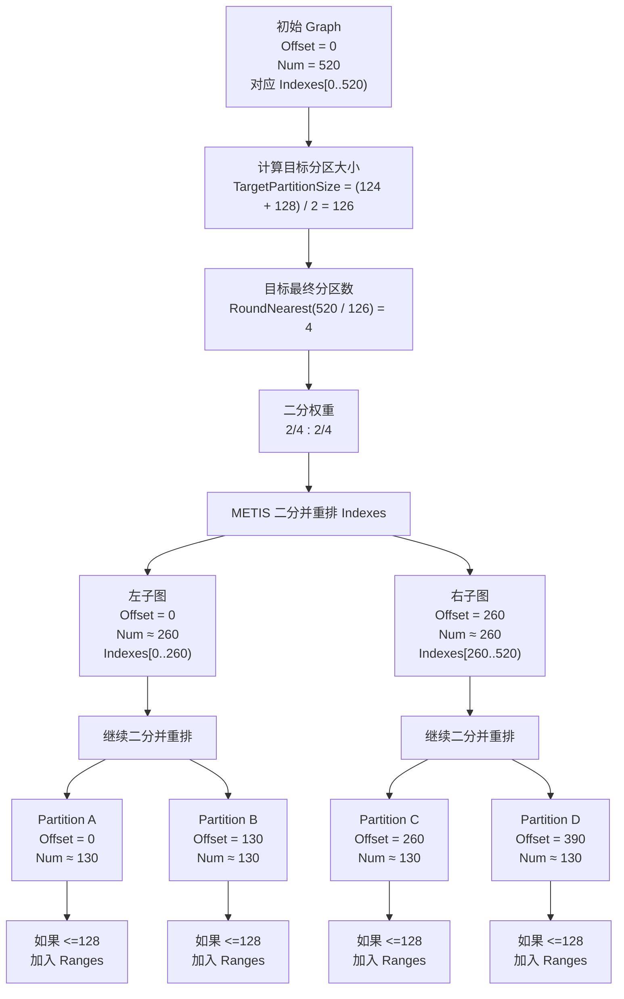

- [1. 离线构建：Nanite Pages](#1-离线构建nanite-pages)
  - [1.1. 构建 Leaf Cluster](#11-构建-leaf-cluster)
    - [1.1.1. 为每条有向 Triangle Edge 建 Hash](#111-为每条有向-triangle-edge-建-hash)
    - [1.1.2. 找共享边并建立三角形邻接信息](#112-找共享边并建立三角形邻接信息)
    - [1.1.3. 构建 Triangle 连通岛](#113-构建-triangle-连通岛)
    - [1.1.4. METIS 递归二分所有 Triangle](#114-metis-递归二分所有-triangle)
    - [1.1.5. 根据分区结果创建 Leaf Cluster](#115-根据分区结果创建-leaf-cluster)
  - [1.2. 构建 Cluster DAG](#12-构建-cluster-dag)
    - [1.2.1. Group 怎么划分](#121-group-怎么划分)
    - [1.2.2. **Reduce** Group](#122-reduce-group)
      - [1.2.2.1. Merge](#1221-merge)
      - [1.2.2.2. Simplify](#1222-simplify)
      - [1.2.2.3. Split](#1223-split)
    - [1.2.3. 总结 Nanite 构建 Cluster DAG](#123-总结-nanite-构建-cluster-dag)
  - [1.3. A Cut of Cluster DAG](#13-a-cut-of-cluster-dag)
  - [1.4. 编码 Cluster DAG](#14-编码-cluster-dag)
- [3. References](#3-references)

本篇笔记是关于 Unreal Engine 中 Nanite 系统的源码分析理解，基于引擎版本 5.7.3 release

## 1. 离线构建：Nanite Pages

### 1.1. 构建 Leaf Cluster

#### 1.1.1. 为每条有向 Triangle Edge 建 Hash

在原始的 mesh 中，顶点索引数据 `Indexes` 中记录了所有三角形的 vertex index，每 3 个 vertex index 是一个三角形，Nanite 按 vertex index 取每条有向三角形边，`EdgeIndex` 实际就是 `Indexes` 中的每个 vertex index，后续在网格简化的源代码中，`CornerIndex` 也是每个 vertex index。

第一步要做的，就是**并行遍历每条有向三角形边并根据每条边的 2 个端点位置计算它的 hash**。

**需要注意的是**： Nanite 中是根据**有向三角形边的 2 个端点的位置**来计算其 hash，而不是根据 vertex index 来计算。这是因为 mesh 可能由于 UV seam/normal seam/hard edge 等原因把同一个位置拆成多个顶点，通过位置来计算 hash 可以保证只要位置能匹配，就能在后续处理的过程中被识别为几何相邻。

同一个位置被拆成多个顶点的一个很典型的例子：一个立方体只有 8 个角点位置，但渲染时常常不是 8 个顶点，而是 24 个顶点，这是因为每个角会被 3 个面使用，而每个面都要有自己的法线、UV。

`Cycle3` 函数在三角形 3 个顶点内循环 + 1，对于任意传入的 `EdgeIndex`（有向三角形边 `EdgeIndex` 的起点），次函数返回此有向三角形边的终点：

```cpp
FORCEINLINE uint32 Cycle3( uint32 Value )
{
    uint32 ValueMod3 = Value % 3;
    uint32 Value1Mod3 = ( 1 << ValueMod3 ) & 3;
    return Value - ValueMod3 + Value1Mod3;
}
```

对于有向三角形边 EdgeIndex，分别取其 2 个端点的位置 `Position0` 和 `Position1`，以 `(Position0, Position1)` 顺序计算这条有向三角形边的 hash，最后将结果添加到 `FEdgeHash::HashTable` 中，其中 Key 是有向三角形边 EdgeIndex 的 hash，Value 是有向三角形边的索引 EdgeIndex ：

```cpp
template< typename FGetPosition >
void Add_Concurrent( int32 EdgeIndex, FGetPosition&& GetPosition )
{
    // 有向三角形边 EdgeIndex 的起点位置
    const FVector3f& Position0 = GetPosition( EdgeIndex );
    // 有向三角形边 EdgeIndex 的终点位置
    const FVector3f& Position1 = GetPosition( Cycle3( EdgeIndex ) );

    // 以 { HashPosition( Position0 ), HashPosition( Position1 ) } 的顺序计算 hash
    uint32 Hash0 = HashPosition( Position0 );
    uint32 Hash1 = HashPosition( Position1 );
    uint32 Hash = Murmur32( { Hash0, Hash1 } );

    // 添加到 HashTable 中: key=hash, value=EdgeIndex
    HashTable.Add_Concurrent( Hash, EdgeIndex );
}
```

#### 1.1.2. 找共享边并建立三角形邻接信息

所谓的共享边，指的是两条有向三角形边满足：**顶点位置相同，方向相反**，如下所示：

```cpp
// Find edge with opposite direction that shares these 2 verts.
/*
      /\
     /  \
    o-<<-o
    o->>-o
     \  /
      \/
*/
```

在上一步为每条有向三角形边建 hash 时是以 `(Position0, Position1)` 的顺序来计算，而这一步则以相反的顺序 `(Position1, Position0)` 来查找**共享边**：

```cpp
template< typename FGetPosition, typename FuncType >
void ForAllMatching( int32 EdgeIndex, bool bAdd, FGetPosition&& GetPosition, FuncType&& Function )
{
    const FVector3f& Position0 = GetPosition( EdgeIndex );
    const FVector3f& Position1 = GetPosition( Cycle3( EdgeIndex ) );

    uint32 Hash0 = HashPosition( Position0 );
    uint32 Hash1 = HashPosition( Position1 );

    // 以 { HashPosition( Position1 ), HashPosition( Position0 ) } 的顺序来计算共享边的 hash
    uint32 Hash = Murmur32( { Hash1, Hash0 } );

    for( uint32 OtherEdgeIndex = HashTable.First( Hash ); HashTable.IsValid( OtherEdgeIndex ); OtherEdgeIndex = HashTable.Next( OtherEdgeIndex ) )
    {
        if( Position0 == GetPosition( Cycle3( OtherEdgeIndex ) ) &&
            Position1 == GetPosition( OtherEdgeIndex ) )
        {
            // Found matching edge.
            Function( EdgeIndex, OtherEdgeIndex );
        }
    }

    if( bAdd )
        HashTable.Add( Murmur32( { Hash0, Hash1 } ), EdgeIndex );
}
```

通过 `FEdgeHash::HashTable` 查找每条有向三角形边的共享边，并将其共享边数量写入 `FAdjacency::Direct` ：

```cpp
// 并行遍历所有有向三角形边
ParallelFor( TEXT("Nanite.ClusterTriangles.PF"), Indexes.Num(), 1024,
    [&]( int32 EdgeIndex )
    {
        int32 AdjIndex = -1;
        int32 AdjCount = 0;
        // 找这条有向三角形边的共享边
        EdgeHash.ForAllMatching( EdgeIndex, false, GetPosition,
            [&]( int32 EdgeIndex, int32 OtherEdgeIndex )
            {
                // 记录找到的共享边的索引 EdgeIndex
                AdjIndex = OtherEdgeIndex;
                AdjCount++;
            } );

        // 找到的共享边数量超过 1 个, 赋值为 -2
        if( AdjCount > 1 )
            AdjIndex = -2;

        // 
        Adjacency.Direct[ EdgeIndex ] = AdjIndex;
    } );
```

最终 `FAdjacency::Direct` 中记录了 **3 种情况**：

1. `FAdjacency::Direct[ EdgeIndex ] = -1`：有向三角形边 EdgeIndex **没有**邻接的共享边，说明它是边界
2. `FAdjacency::Direct[ EdgeIndex ] >= 0`：有向三角形边 EdgeIndex **有唯一**邻接的共享边，也就是说这条边被 2 个三角形共享，这种边叫做流形（Manifold）边，有向三角形边大多数情况下都是流形边
3. `FAdjacency::Direct[ EdgeIndex ] = -2`：有向三角形边 EdgeIndex **有多个**邻接的共享边，也就是说这条边被超过 2 个三角形共享，这种边叫做非流形边，这是一种特殊情况

对于非流形边，需要进行**额外的处理**：

非流形边有多个（>= 2）共享边，所以先找出其所有的共享边，然后再将找到的共享边按 vertex index **排序**，最后再将非流形边的邻接共享边信息写入 `FAdjacency::Extended` 中，`FAdjacency::Extended` 本质上是允许重复 Key 的 `TMap`，记录了非流形有向三角形边的所有共享边的 EdgeIndex。

**注意**：按 vertex index 排序的操作是很重要的：因为 EdgeHash 是并行构建的，所以 `FEdgeHash::HashTable` 中元素的顺序是不固定的，先按照 vertex index 进行排序可以保证**构建结果的确定性（Determinism）**。

```cpp
// 额外处理非流形边
if( Adjacency.Direct[ EdgeIndex ] == -2 )
{
    // 先找出所有共享边
    TArray< TPair< int32, int32 >, TInlineAllocator< 16 > > Edges;
    EdgeHash.ForAllMatching( EdgeIndex, false, GetPosition,
        [&]( int32 EdgeIndex0, int32 EdgeIndex1 )
        {
            Edges.Emplace( EdgeIndex0, EdgeIndex1 );
        } );

    // 然后按 vertex index 排序, 保证结果的确定性
    Edges.Sort();

    // 最后写入 Adjacency.Extended
    for( const TPair< int32, int32 >& Edge : Edges )
    {
        Adjacency.Link( Edge.Key, Edge.Value );
    }
}
```

到这里，我们知道了每条有向三角形边的共享边信息，也就是说：**对于任意有向三角形边，我们可以根据其共享边信息而知道它被哪几个三角形共享**，同样的：**对于任意三角形，我们同样可以根据其三条边的共享边信息而得到它与其它哪些三角形之间是否存在共享边**。

#### 1.1.3. 构建 Triangle 连通岛

所谓的三角形连通岛，是**把每个三角形看成图上的一个节点，如果两个三角形在几何上共享同一条边，就在它们之间建立邻接关系；沿着这些邻接关系可以互相到达的一组三角形，就构成一个连通岛**。

Nanite 通过上一步构建的 `FAdjacency` 数据构建一个 `FDisjointSet`，把通过共享边相连通的三角形合并成连通岛。

```cpp
inline void FDisjointSet::Init( uint32 Size )
{
    Parents.SetNumUninitialized( Size, EAllowShrinking::No);
    for( uint32 i = 0; i < Size; i++ )
    {
        Parents[i] = i;
    }
}
```

初始化 `FDisjointSet` 时，一共 `Size` 个三角形每个自成一个连通岛，也就是说，每个连通岛的根节点都是每个三角形自己 `Parents[i] = i`

```cpp
template< typename FuncType >
void ForAll( int32 EdgeIndex, FuncType&& Function ) const
{
    int32 AdjIndex = Direct[ EdgeIndex ];
    if( AdjIndex >= 0 )
    {
        Function( EdgeIndex, AdjIndex );
    }

    for( auto Iter = Extended.CreateConstKeyIterator( EdgeIndex ); Iter; ++Iter )
    {
        Function( EdgeIndex, Iter.Value() );
    }
}

// 遍历每条有向三角形边的所有共享边
Adjacency.ForAll( EdgeIndex,
    [&]( int32 EdgeIndex0, int32 EdgeIndex1 )
    {
        // 根据 EdgeIndex / 3 计算得到所属的三角形 index
        // 将存在共享边的 2 个三角形 union 到同一个连通岛
        if( EdgeIndex0 > EdgeIndex1 )
            DisjointSet.UnionSequential( EdgeIndex0 / 3, EdgeIndex1 / 3 );
    } );
```

遍历每条有向三角形边，获取它们所有的共享边，根据 `EdgeIndex / 3` 计算出其所属的三角形，并将这些存在共享边的三角形合并（Union）到同一个连通岛，合并时**会让父节点编号较小的一侧逐步挂到父节点编号较大的一侧，这里的编号指的是三角形 index**

```cpp
// Union with splicing
inline void FDisjointSet::Union( uint32 x, uint32 y )
{
    uint32 px = Parents[x];     // x 的父节点 px
    uint32 py = Parents[y];     // y 的父节点 py

    while( px != py )           // x 的父节点与 y 的父节点不同, 进行合并
    {
                                // 始终将父节点编号较小的一侧合并到父节点编号较大的一侧
        if( px < py )           // px 更小
        {
            Parents[x] = py;    // x 的父节点直接设置为 py
            if( x == px )       // x 的父节点就是 x 本身, 则说明 x 所在的连通岛上所有节点已经合并完成
            {
                return;
            }
            x = px;             // 继续往上合并 x 的父节点
            px = Parents[x];
        }
        else                    // py 更小, 则反之
        {
            Parents[y] = px;
            if( y == py )
            {
                return;
            }
            y = py;
            py = Parents[y];
        }
    }
}
```

- `DisjointSet::Union()` 方法核心的逻辑就是：从 `x` 和 `y` 各自当前的父节点 `px`、`py` 开始，沿着两边的父链向根节点推进，每一步都把父节点编号较小的一侧挂到编号较大的一侧，如果被挂接的节点已经是该侧的根节点，则表示合并完成。另外 UE 还提供了一个特化版本的合并方法 `FDisjointSet::UnionSequential()`，使用这个方法有一定的前提（x 本身是根节点并且 x >= y），当然这个方法合并也更效率，Nanite 构建三角形连通岛时，使用的就是此方法。

```cpp
// Find with path compression
inline uint32 FDisjointSet::Find( uint32 i )
{
    // 找到节点 i 所在连通岛的根节点 Root
    uint32 Start = i;
    uint32 Root = Parents[i];
    while( Root != i )
    {
        i = Root;
        Root = Parents[i];
    }

    // 路径压缩: 并且把 i 到 Root 之间的所有节点的父节点都设置为 Root
    i = Start;
    uint32 Parent = Parents[i];
    while( Parent != Root )
    {
        Parents[i] = Root;
        i = Parent;
        Parent = Parents[i];
    }

    return Root;
}
```

- `FDisjointSet::Find()` 方法用于查找某个节点的根节点 `Root`，并且还会**压缩路径：将节点 i 到 i 的根节点 Root 之间的所有节点的父节点都设置为 i 的根节点 Root**，这样后续再查找此路径上任意节点的根节点时，只需要一次内存访问即可。

#### 1.1.4. METIS 递归二分所有 Triangle

有了三角形的连通信息，下面要做的就是对所有的三角形进行**分区（Partition）**：

首先构建三角形图（Triangle Graph），每个三角形是图中的一个节点，节点与节点之间的边有两类：第一类是**拓扑邻接**，第二类是**空间局部性邻接**，最后使用 METIS 递归二分图，直到每个分区图不超过 128 个节点，也就是 128 个三角形。

Nanite 中一个 cluster 包含 128 个三角形（`FCluster::ClusterSize=128`），在划分时每个分区三角形的目标大小是 `124 ～ 128` ：

```cpp
FGraphPartitioner Partitioner( NumTriangles, FCluster::ClusterSize - 4, FCluster::ClusterSize );
```

所谓的拓扑邻接，指的是 2 个三角形有真实的共享边，拓扑邻接关系我们可以通过共享边获取；而空间局部性邻接则指的是 2 个三角形在真实 3D 空间上邻近，Nanite 通过 `FGraphPartitioner::BuildLocalityLinks()` 方法建立部分三角形弱空间局部性邻接信息：

先说说 **Morton 编码**，它又叫做 **Z-order Curve** 或 **Z 值编码**，Morton 编码有一个很重要的性质： **3D 空间上接近的点，其 Morton 编码也接近**，也就是说： **3D 空间上的邻居对应排序后 Morton 数组中的邻居**

Nanite 第一步做的，是计算所有三角形的空间局部顺序：计算每个三角形中心点在模型空间的 3D 坐标并归一化到模型空间 AABB 中，然后计算其对应的 Morton 编码，最后根据 Morton 编码排序所有三角形：

```cpp
auto GetCenter = [ &Verts, &Indexes ]( uint32 TriIndex )
{
    FVector3f Center;
    Center  = Verts.Position[ Indexes[ TriIndex * 3 + 0 ] ];
    Center += Verts.Position[ Indexes[ TriIndex * 3 + 1 ] ];
    Center += Verts.Position[ Indexes[ TriIndex * 3 + 2 ] ];
    return Center * (1.0f / 3.0f);
};

ParallelFor( TEXT("BuildLocalityLinks.PF"), NumElements, 4096,
    [&]( uint32 Index )
    {
        // 获取三角形中心点坐标
        FVector3f Center = GetCenter( Index );
        // 归一化到 mesh AABB
        FVector3f CenterLocal = ( Center - Bounds.Min ) / FVector3f( Bounds.Max - Bounds.Min ).GetMax();

        // 计算 Morton 编码
        uint32 Morton;
        Morton  = FMath::MortonCode3( uint32( CenterLocal.X * 1023 ) );
        Morton |= FMath::MortonCode3( uint32( CenterLocal.Y * 1023 ) ) << 1;
        Morton |= FMath::MortonCode3( uint32( CenterLocal.Z * 1023 ) ) << 2;
        SortKeys[ Index ] = Morton;
    } );

// 根据 Morton 编码排序所有三角形
RadixSort32( SortedTo.GetData(), Indexes.GetData(), NumElements,
    [&]( uint32 Index )
    {
        return SortKeys[ Index ];
    } );

SortKeys.Empty();

// Swap 之后, Indexes 中是排序后的三角形 index
Swap( Indexes, SortedTo );
// 建立映射数组, SortedTo 中记录了原始三角形 index 到排序后位置的映射
for( uint32 i = 0; i < NumElements; i++ )
{
    SortedTo[ Indexes[i] ] = i;
}
```

按 Morton 编码排序之后，`FGraphPartitioner::Indexes` 中记录了排序后的三角形 index 列表，而 `FGraphPartitioner::SortedTo` 中记录了原始三角形 index 到排序后位置的反向映射，也就是给定一个三角形原始 index，可以通过 `FGraphPartitioner::SortedTo` 快速得到它在当前排序序列中的位置

第二步，在已经按 Morton 编码排序的 `Indexes` 中，记录**连续属于同一个连通岛的三角形元素区间**：

```cpp
TArray< FRange > IslandRuns;
IslandRuns.AddUninitialized( NumElements );

// Run length acceleration
// Range of identical IslandID denoting that elements are connected.
// Used for jumping past connected elements to the next nearby disjoint element.
{
    uint32 RunIslandID = 0;
    uint32 RunFirstElement = 0;

    // 遍历排序后的 Indexes
    for( uint32 i = 0; i < NumElements; i++ )
    {
        // 获取三角形所在的连通岛 ID
        uint32 IslandID = DisjointSet.Find( Indexes[i] );

        // 一个新的连通岛区间
        if( RunIslandID != IslandID )
        {
            // 将属于上一个连通岛区间的所有元素的 End 设置为新的连通岛区间的起始元素索引
            for( uint32 j = RunFirstElement; j < i; j++ )
            {
                IslandRuns[j].End = i;
            }
        
            // 记录当前的连通岛 ID
            RunIslandID = IslandID;
            // 当前连通岛 ID 的起始元素索引
            RunFirstElement = i;
        }

        // 如果仍然在同一个连通岛区间, 每个元素的 Begin 都是当前连通岛 ID 的起始元素索引
        IslandRuns[i].Begin = RunFirstElement;
    }
    // Finish the last run
    for( uint32 j = RunFirstElement; j < NumElements; j++ )
    {
        IslandRuns[j].End = NumElements;
    }
}
```

Nanite 根据连通岛信息，在排好序后的 `Indexes` 上构建 `IslandRuns`，记录每个三角形元素所在的**连续相同连通岛区间**。这样做的核心目的有 2 个：

- 避免给同一个连通岛内部的三角形再构建空间局部邻接信息
- 遇到同一连通岛的连续区间时，可以整段跳过，从而加速空间局部邻接信息的搜索和构建

最后一步，也就是构建空间局部邻接信息：

```cpp
for( uint32 i = 0; i < NumElements; i++ )
{
    // 原始三角形 index
    uint32 Index = Indexes[i];

    uint32 RunLength = IslandRuns[i].Num();
    // 只有三角形所在的连续连通岛区间少于 128 个三角形时, 才为其构建空间局部邻接信息
    if( RunLength < 128 )
    {
        // 当前三角形所属的连通岛 ID
        uint32 IslandID = DisjointSet[ Index ];
        // 当前元素所属的 GroupID , 这里的 GroupIndexes 是 mesh 的材质数组 MaterialIndexes, 所以这里的 GroupID 指的是材质 ID
        int32 GroupID = bElementGroups ? GroupIndexes[ Index ] : 0;

        // 当前三角形中心 3D 坐标
        FVector3f Center = GetCenter( Index );

        // 为当前三角形寻找最多 5 个空间局部邻接三角形
        const uint32 MaxLinksPerElement = 5;

        // 记录邻接三角形 index
        uint32 ClosestIndex[MaxLinksPerElement];
        // 记录当前三角形与邻接三角形的距离平方
        float  ClosestDist2[MaxLinksPerElement];
        for (int32 k = 0; k < MaxLinksPerElement; k++)
        {
            ClosestIndex[k] = ~0u;
            ClosestDist2[k] = MAX_flt;
        }

        // 分别向按 Morton 编码排好序后的 Indexes 前后两个方向搜索
        for( int Direction = 0; Direction < 2; Direction++ )
        {
            uint32 Limit = Direction ? NumElements - 1 : 0;
            uint32 Step  = Direction ? 1 : -1;

            uint32 Adj = i;
            // 每个方向最多迭代 16 次
            for( int32 Iterations = 0; Iterations < 16; Iterations++ )
            {
                // 到 Indexes 边界, 跳出查找
                if( Adj == Limit )
                    break;
                Adj += Step;

                uint32 AdjIndex = Indexes[ Adj ];
                uint32 AdjIslandID = DisjointSet[ AdjIndex ];
                int32 AdjGroupID = bElementGroups ? GroupIndexes[AdjIndex] : 0;
                // 跳过属于相同连通岛或使用不同材质的三角形
                if( IslandID == AdjIslandID || ( GroupID != AdjGroupID ) )
                {
                    // Skip past this run
                    if( Direction )
                        Adj = IslandRuns[ Adj ].End - 1;
                    else
                        Adj = IslandRuns[ Adj ].Begin;
                }
                else
                {
                    // Add to sorted list
                    // 计算实际距离平方
                    float AdjDist2 = ( Center - GetCenter( AdjIndex ) ).SizeSquared();
                    // 使用插入排序写入有序列表
                    for( int k = 0; k < MaxLinksPerElement; k++ )
                    {
                        if( AdjDist2 < ClosestDist2[k] )
                        {
                            Swap( AdjIndex, ClosestIndex[k] );
                            Swap( AdjDist2, ClosestDist2[k] );
                        }
                    }
                }
            }
        }

        // 建立双向空间局部邻接信息
        for( int k = 0; k < MaxLinksPerElement; k++ )
        {
            if( ClosestIndex[k] != ~0u )
            {
                // Add both directions
                LocalityLinks.AddUnique( Index, ClosestIndex[k] );
                LocalityLinks.AddUnique( ClosestIndex[k], Index );
            }
        }
    }
}
```

对于按 Morton 编码排好序的三角形 `Indexes`，Nanite **只会为属于较小连续连通岛区间内的三角形构建空间局部邻接信息**，也就是该区间内的三角形数量小于 128。对于这些三角形，会沿排好序后的 `Indexes` 向前、后两个方向各最多执行 16 次搜索迭代，搜索过程中会**跳过同连通岛 ID 或不同分组 ID （在这里，不同分组 ID 指的是不同材质 ID）**的连续区间，从剩余候选中按**实际 3D 空间距离选出最多 5 个**最近三角形，并构建双向的空间局部邻接关系。

从这里可以看出，Nanite 在构建空间局部邻接信息时，会尝试在**3D 空间上接近、材质相同，但不属于同一几何连通块的三角形之间建立空间局部邻接关系**。

最后，Nanite 根据前面得到的两类邻接信息，构建 METIS 使用的图结构，并进行递归二分：

```cpp
auto* RESTRICT Graph = Partitioner.NewGraph( NumTriangles * 3 );

for( uint32 i = 0; i < NumTriangles; i++ )
{
    Graph->AdjacencyOffset[i] = Graph->Adjacency.Num();

    // 按 Partitioner.Indexes 的顺序遍历三角形
    uint32 TriIndex = Partitioner.Indexes[i];

    // 拓扑邻接, 高权重 260, Nanite 强烈倾向将共享真实几何边的三角形分到同一个分区
    for( int k = 0; k < 3; k++ )
    {
        Adjacency.ForAll( 3 * TriIndex + k,
            [ &Partitioner, Graph ]( int32 EdgeIndex, int32 AdjIndex )
            {
                Partitioner.AddAdjacency( Graph, AdjIndex / 3, 4 * 65 );
            } );
    }

    // 空间局部邻接, 极低权重 1
    Partitioner.AddLocalityLinks( Graph, TriIndex, 1 );
}
Graph->AdjacencyOffset[ NumTriangles ] = Graph->Adjacency.Num();

bool bSingleThreaded = NumTriangles < 5000;

// 递归二分
Partitioner.PartitionStrict( Graph, !bSingleThreaded );
check( Partitioner.Ranges.Num() );
```

在构建 METIS 使用的图结构时，是按 `Partitioner.Indexes` 中的顺序遍历三角形，也就是说： **METIS 图中的节点 i 表示的是按 Morton 编码排序后的三角形 Indexes[i]，而不是原始三角形 i**，所以**后续所有邻接三角形的原始 index 都要通过 `FGraphPartitioner::SortedTo` 转换成排好序后的 index**。在 `FGraphPartitioner::AddAdjacency` 和 `FGraphPartitioner::AddLocalityLinks` 方法中都有 `SortedTo[ AdjIndex ]` 转换的操作。

图节点之间，先通过共享边信息添加拓扑邻接权重，拓扑邻接的权重是 `260`，说明 **Nanite 强烈倾向将共享真实几何边的三角形划分在同一个分区**；再通过空间局部邻接信息添加空间局部邻接权重，空间局部邻接的权重是 `1`，远远低于拓扑邻接的权重，说明 Nanite 希望**3D 空间上靠近的三角形，尽量别分太远，但如果和拓扑邻接冲突，则拓扑邻接的优先级要高得多**。

这里简单介绍一下 METIS ：

METIS 是一个用于**图划分、有限元网格划分、稀疏矩阵重排序**的库，这里有一个关于怎么使用 METIS 库进行图划分的文章[使用 METIS 软件包进行图划分](https://www.jianshu.com/p/55e6b6897057)。另外，关于 METIS 的控制参数 `Options[ METIS_OPTION_UFACTOR ]`，它用于控制划分后子分区之间允许的不平衡程度（以千分之一为单位），简单来说：就是划分后每个子分区多可以比“理想大小”大多少。假设一个图一共有 N 个节点，要将其划分为 `k` 个子分区，那么理想情况下，每个子分区应该包含 `N/k` 个节点，如果 `Options[ METIS_OPTION_UFACTOR ] = 20`，那么每个子分区最多比理想大小多 2%（20/1000=0.02）的节点数

具体递归二分划分的代码在这里就不详细展开讲了，主要的逻辑如下：

- 首先，图中的节点表示的是 `Partitioner.Indexes` 中一个连续区间中的元素，`Graph->Offset` 记录连续区间的起点，`Graph->Num` 记录了连续区间中的元素数量
- 每次二分时，会把当前图的目标分区大小设置为 `(MinPartitionSize + MaxPartitionSize) / 2`，在构建 leaf cluster 时，这个值是 `(124 + 128) / 2 = 126`
- 计算当前图的目标最终分区数： `Max(2, DivideAndRoundNearest(Graph->Num, TargetPartitionSize))`
- 根据这个目标分区数给二分两侧设置权重（例如目标 5 个分区时，权重是 `2/5` 和 `3/5`）
- 调用 `METIS_PartGraphRecursive` 把当前图二分，根据划分结果原地重排序（插入排序）这个连续区间，使被划分到不同分区的元素分别处于这个连续分区的两侧，也就是说：**将一个连续区间划分为两个子连续区间**
- 划分后的两个子连续区间如果大小都小于 `MaxPartitionSize`，则直接把这两个子连续区间当作最终分区添加进 `Partitioner.Ranges` 中；否则继续为这两个子连续区间分别构建子图，并继续二分这两个子连续区间
- 如果要被划分的图中的节点数量小于 `MaxPartitionSize`，则直接把整个图代表的连续区间当作一个最终分区添加进 `Partitioner.Ranges` 中，并跳出递归二分

最后画一个递归二分的图来帮助理解：



最终的分区结果存储在 `Partitioner.Ranges` 中，它记录了**经历了多次二分和原地重排序后的 `Partitioner.Indexes` 数组中的连续区间**，每个元素 `FRange` 表示一个分区在 `Partitioner.Indexes` 中的范围，`FRange::Begin` 是分区起点，`FRange::End` 是分区终点，`FRange::Num` 是这个分区里面三角形元素的数量。

#### 1.1.5. 根据分区结果创建 Leaf Cluster

<!-- 另外，由于原 `Partitioner.Indexes` 是根据 Morton 编码排好序后的三角形 index 数组，所以真正的原始三角形 index 还需要通过 `Partitioner.Indexes[Begin..End]` 获取。 -->

根据 `Partitioner.Ranges` 中的每个 `FRange` 元素创建所有的 leaf cluster：

```cpp
{
    TRACE_CPUPROFILER_EVENT_SCOPE(Nanite::Build::BuildClusters);
    ParallelFor( TEXT("Nanite.BuildClusters.PF"), Partitioner.Ranges.Num(), 1024,
        [&]( int32 Index )
        {
            auto& Range = Partitioner.Ranges[ Index ];

            uint32 ClusterIndex = BaseCluster + Index;

            Clusters[ ClusterIndex ] = FCluster(
                Verts,
                Indexes,
                MaterialIndexes,
                VertexFormat,
                Range.Begin, Range.End,
                Partitioner.Indexes, Partitioner.SortedTo, Adjacency );

            // Negative notes it's a leaf
            Clusters[ ClusterIndex ].EdgeLength *= -1.0f;

            MeshInput[ MeshIndex ][ Index ] = FClusterRef( ClusterIndex );
        });
}
```

由于 `FRange` 中记录的是 `Partitioner.Indexes` 中的某个连续区间，而 `Partitioner.Indexes` 又是**根据 Morton 编码排序后**的三角形 index 数组，所以要先通过 `SortedIndexes[i]` 转换为原始 mesh 中的三角形 index，然后根据此三角形 index 再去读取原始 mesh 中每个顶点的属性并构建 cluster 内部的基础 mesh 信息。

```cpp
for( uint32 i = Begin; i < End; i++ )
{
    // Begin/End 是 Partitioner.Indexes 中某个连续区间的起始/终点, 通过 SortedIndexes[i] 转换为原始 mesh 中的三角形 index
    uint32 TriIndex = SortedIndexes[i];

    ...
}
```

创建 leaf cluster 时，首先会构建 cluster 的基础 mesh 数据：

```cpp
// 原始 mesh 中每个三角形的顶点索引
uint32 OldIndex = InIndexes[ TriIndex * 3 + k ];

// 是否已经添加过此顶点
//   - 添加过: 只需要向 Indexes 中新增此顶点的索引
//   - 没有添加过: 向 Verts 中添加一个新的局部顶点, 并拷贝相关顶点属性, 最后向 Indexes 中新增此顶点的索引
uint32* NewIndexPtr = OldToNewIndex.Find( OldIndex );
uint32 NewIndex = NewIndexPtr ? *NewIndexPtr : ~0u;

// 没有添加过
if( NewIndex == ~0u )
{
    // 向 Verts 添加一个新的局部顶点
    NewIndex = Verts.AddUninitialized();
    // 建立原始 mesh 顶点索引到 cluster 局部顶点索引的映射
    OldToNewIndex.Add( OldIndex, NewIndex );

    // 拷贝 position, normal 顶点属性
    Verts.GetPosition( NewIndex ) = InVerts.Position[OldIndex];
    Verts.GetNormal( NewIndex ) = InVerts.TangentZ[OldIndex];

    // 拷贝 tangent, tangent sign 顶点属性
    if( Verts.Format.bHasTangents )
    {
        const float TangentYSign = ((InVerts.TangentZ[OldIndex] ^ InVerts.TangentX[OldIndex]) | InVerts.TangentY[OldIndex]);
        Verts.GetTangentX( NewIndex ) = InVerts.TangentX[OldIndex];
        Verts.GetTangentYSign( NewIndex ) = TangentYSign < 0.0f ? -1.0f : 1.0f;
    }

    // 拷贝 color 顶点属性
    if( Verts.Format.bHasColors )
    {
        Verts.GetColor( NewIndex ) = InVerts.Color[OldIndex].ReinterpretAsLinear();
    }

    // 拷贝 UV 顶点属性
    if( Verts.Format.NumTexCoords > 0 )
    {
        FVector2f* UVs = Verts.GetUVs( NewIndex );
        for( uint32 UVIndex = 0; UVIndex < Verts.Format.NumTexCoords; UVIndex++ )
        {
            UVs[UVIndex] = InVerts.UVs[UVIndex][OldIndex];
        }
    }

    // 拷贝 bone index/bone weight 顶点属性
    if( Verts.Format.NumBoneInfluences > 0 )
    {
        FVector2f* BoneInfluences = Verts.GetBoneInfluences(NewIndex);
        for (uint32 Influence = 0; Influence < Verts.Format.NumBoneInfluences; Influence++)
        {
            BoneInfluences[Influence].X = InVerts.BoneIndices[Influence][OldIndex];
            BoneInfluences[Influence].Y = InVerts.BoneWeights[Influence][OldIndex];
        }
    }
}

// 向局部 Indexes 中添加此顶点索引
Indexes.Add( NewIndex );

...

// 拷贝原始 mesh 中三角形的材质索引, 并添加到 cluster 局部三角形材质索引 MaterialIndexes 中
MaterialIndexes.Add( InMaterialIndexes[ TriIndex ] );
```

然后还会构建 cluster 与其它 clutser 之间的拓扑邻接信息：

```cpp
// 取每条有向三角形边
int32 EdgeIndex = TriIndex * 3 + k;
int32 AdjCount = 0;

// 找此有向三角形边在原 mesh 中的共享边
Adjacency.ForAll( EdgeIndex,
    [ &AdjCount, Begin, End, &SortedTo ]( int32 EdgeIndex, int32 AdjIndex )
    {
        // AdjIndex / 3 得到邻接三角形原始 index, 再通过 SortedTo[ AdjIndex / 3 ] 转换到按 Morton 编码排序后的 SortedIndexes 中的 index
        uint32 AdjTri = SortedTo[ AdjIndex / 3 ];
        // 确认这个邻接三角形在不在当前 Cluster 的 [Begin, End) 区间中, 如果不在则表明此邻接三角形属于另一个 Cluster, 也就是说明这条有向三角形边与其它 Cluster 邻接, 是它所在 Cluster 的边界
        if( AdjTri < Begin || AdjTri >= End )
            AdjCount++;
    } );

// 记录当前 Cluster 内这条有向三角形边是否与其它 Cluster 邻接, AdjCount == 0 说明这条边是 Cluster 内部边, AdjCount > 0 说明这条边是 Cluster 的边界 (与其它 Cluster 邻接)
ExternalEdges.Add( (int8)AdjCount );
// 累积所有边界边的数量
NumExternalEdges += AdjCount != 0 ? 1 : 0;
```

`ExternalEdges` 中的每个 `int8` 元素记录 cluster 中一条有向三角形边的**外部邻接边数量**：值为 0 表示该边没有连接到 cluster 外部的邻接三角形；值大于 0 表示该边与 cluster 外部的三角形邻接，因此是 cluster 边界边。而 `NumExternalEdges` 记录了 cluster 中边界边的总数量。

最后还会计算 cluster 的包围盒等信息：

```cpp
// 计算 Cluster 的 AABB
for( uint32 i = 0; i < Verts.Num(); i++ )
{
    Positions[i] = Verts.GetPosition(i);
    Bounds += Positions[i];
}
// 计算 Cluster 的 SphereBounds
SphereBounds = FSphere3f( Positions.GetData(), Positions.Num() );
LODBounds = SphereBounds;

float MaxEdgeLength2 = 0.0f;
for( int i = 0; i < Indexes.Num(); i += 3 )
{
    // Cluster 的每个三角形
    FVector3f v[3];
    v[0] = Verts.GetPosition( Indexes[ i + 0 ] );
    v[1] = Verts.GetPosition( Indexes[ i + 1 ] );
    v[2] = Verts.GetPosition( Indexes[ i + 2 ] );

    // 每条有向三角形边
    FVector3f Edge01 = v[1] - v[0];
    FVector3f Edge12 = v[2] - v[1];
    FVector3f Edge20 = v[0] - v[2];

    // 更新最长边的平方
    MaxEdgeLength2 = FMath::Max( MaxEdgeLength2, Edge01.SizeSquared() );
    MaxEdgeLength2 = FMath::Max( MaxEdgeLength2, Edge12.SizeSquared() );
    MaxEdgeLength2 = FMath::Max( MaxEdgeLength2, Edge20.SizeSquared() );

    // 三角形的面积: ^ 是叉乘, |a x b| = 平行四边形面积, 所以三角形 Mesh 的面积 = 0.5 * 平行四边形面积
    float TriArea = 0.5f * ( Edge01 ^ Edge20 ).Size();
    // 累计 Cluster 内所有三角形面积和
    SurfaceArea += TriArea;
}
// 记录 Cluster 内最大三角形边长
EdgeLength = FMath::Sqrt( MaxEdgeLength2 );
```

其中，`Bounds` 是 cluster 的 AABB；包围球 `SphereBounds`；LOD 包围范围 `LODBounds`，在 leaf cluster 中其初始为 `LODBounds = SphereBounds`；以及 cluster 中所有三角形的面积和 `SurfaceArea` 与 cluster 中所有三角形中最长的边的边长 `EdgeLength`

**需要注意的是**，对于 leaf cluster，Nanite 会将其 `EdgeLength` 设置为负数：

```cpp
// Negative notes it's a leaf
Clusters[ ClusterIndex ].EdgeLength *= -1.0f;
```

另外，Nanite 通过**Ritter 包围球算法（Ritter’s Bounding Sphere Algorithm）**计算 cluster 的包围球 `SphereBounds`，在这里额外贴一下 Ritter 包围球算法的代码：

```cpp
// [ Ritter 1990, "An Efficient Bounding Sphere" ]
template<typename T>
static FORCEINLINE void ConstructFromPoints(TSphere<T>& ThisSphere, const TVector<T>* Points, int32 Count)
{
    check(Count > 0);

    // Min/max points of AABB
    // 1. 找 AABB 的三个轴的极点值
    int32 MinIndex[3] = { 0, 0, 0 };    // { X 轴最小, Y 轴最小, Z 轴最小 }
    int32 MaxIndex[3] = { 0, 0, 0 };    // { X 轴最大, Y 轴最大, Z 轴最大 }

    for (int i = 0; i < Count; i++)
    {
        for (int k = 0; k < 3; k++)
        {
            MinIndex[k] = Points[i][k] < Points[MinIndex[k]][k] ? i : MinIndex[k];
            MaxIndex[k] = Points[i][k] > Points[MaxIndex[k]][k] ? i : MaxIndex[k];
        }
    }

    // 2. 找跨度最大的轴
    T LargestDistSqr = 0.0f;
    int32 LargestAxis = 0;
    for (int k = 0; k < 3; k++)
    {
        TVector<T> PointMin = Points[MinIndex[k]];
        TVector<T> PointMax = Points[MaxIndex[k]];

        T DistSqr = (PointMax - PointMin).SizeSquared();
        if (DistSqr > LargestDistSqr)
        {
            LargestDistSqr = DistSqr;
            LargestAxis = k;
        }
    }

    // 3. 用最远的两点初始化球, 此时球正好包住这两个极端点, 但可能还包不住其它点
    TVector<T> PointMin = Points[MinIndex[LargestAxis]];
    TVector<T> PointMax = Points[MaxIndex[LargestAxis]];

    ThisSphere.Center = 0.5f * (PointMin + PointMax);
    ThisSphere.W = 0.5f * FMath::Sqrt(LargestDistSqr);
    T WSqr = ThisSphere.W * ThisSphere.W;

    // Adjust to fit all points
    // 扩张包围球以包住所有点
    for (int i = 0; i < Count; i++)
    {
        T DistSqr = (Points[i] - ThisSphere.Center).SizeSquared();

        if (DistSqr > WSqr)
        {
            // **Ritter 算法核心**: 扩大并移动球心以包住该点
            T Dist = FMath::Sqrt(DistSqr);
            T t = 0.5f + 0.5f * (ThisSphere.W / Dist);

            ThisSphere.Center = FMath::LerpStable(Points[i], ThisSphere.Center, t);
            ThisSphere.W = 0.5f * (ThisSphere.W + Dist);
        }
    }
}
```

到这里，Nanite 完成了 leaf cluster 的构造。而下一步要做的，就是从 leaf cluster 开始，一级一级往上构建整个 **cluster 有向无环图（Directed Acyclic Graph，DAG）**

### 1.2. 构建 Cluster DAG

在这里，引用 UE 在 SIGGRAPH 2021 中对构建 cluster DAG 流程的描述：

```text
First we need to build the leaf clusters
In our case a cluster is 128 triangles

Then for each LOD level
  - We group clusters to clean their shared boundary
  - Merge the triangles from the group into a shared list
  - Simplify to half the number of triangles
  - Then split the simplified list of triangles back into clusters

Repeat this process until there is only 1 cluster left at the root.
```

总结一下核心流程：

首先构建 leaf cluster，也就是 LOD0 的 cluster，这一步目前已经完成

然后从 LOD0 开始，重复将当前 LOD 层的 cluster 按**拓扑邻接/空间局部性邻接**划分成多个 groups，**每个 group 内的 cluster 被称为此 group 的 children cluster**，把 group 的所有 children cluster 合并成一个 **merged cluster**，然后将此 merged cluster **简化到约一半三角形数量**，最后将简化后的 merged cluster 重新切分成新的 parent cluster；这些 parent cluster 作为下一层 LOD 输入继续**重复**进行上面**划分 groups -> 合并 group 内 children cluster -> 简化 -> 切分 parent cluster**的处理；直到最终只剩一个 cluster，这个 cluster 叫做 root cluster，root cluster 单独构成一个 root group

下面展示了一个简单的流程示意图：


第一步（上图左），黄色、红色、绿色和蓝色这 4 个 leaf cluster 被划分到同一个 group 中，它们是 LOD0 层；

第二步（上图中），把这个 group 内的 4 个 children cluster 合并成一个 merged cluster 并对其进行简化；

最后（上图右），将简化后的 merged cluster 重新切分成橙色和粉红色这 2 个 parent cluster，这 2 个 parent cluster 是 LOD1 层；

可以看到，一个 group 的所有 children cluster 先合并再简化最后生成若干 parent cluster，父子之间不是传统树（tree）结构里的”一父对应多个子“或“一子只有一个父”的严格几何包含关系，而是**group 内多 children cluster 到多 parent cluster 的替代关系，生成的 parent cluster 共同替代 group 的所有 children cluster**

#### 1.2.1. Group 怎么划分

我们知道，Nanite 在构建 leaf cluster 时，会先构建原始 mesh 中三角形之间的**拓扑邻接信息**和**空间局部性邻接信息**，然后构建三角形图，图中的每个节点代表每个三角形，再根据拓扑邻接/空间局部性邻接设置图节点之间的权重，最终使用图划分库 METIS 将三角形划分到不同的 cluster。

对 cluster 划分 group 也是相似的逻辑：首先构建 cluster 之间的拓扑邻接信息和空间局部性邻接信息；然后构建 cluster 图，图中的每个节点代表每个 cluster；再根据 cluster 之间的这 2 类邻接关系设置图节点之间的权重；最后使用图划分库 METIS 将 cluster 划分到不同的 group：

先为每个 cluster 的每条边界边建 hash，并添加到边界边的 hash table 中：

```cpp
// Add edges to hash table
// 首先为每个 cluster 的每条边界边建 hash, 并添加进 hash table 中
ParallelFor(TEXT("Nanite.EdgeHashAdd.PF"), LevelClusters.Num(), 32,
    [&](uint32 ClusterRefIndex)
    {
        FCluster &Cluster = LevelClusters[ClusterRefIndex].GetCluster(*this);

        for (int32 EdgeIndex = 0; EdgeIndex < Cluster.ExternalEdges.Num(); EdgeIndex++)
        {
            // 只对 cluster 的边界边建 hash
            if (Cluster.ExternalEdges[EdgeIndex])
            {
                uint32 VertIndex0 = Cluster.Indexes[EdgeIndex];
                uint32 VertIndex1 = Cluster.Indexes[Cycle3(EdgeIndex)];

                const FVector3f &Position0 = Cluster.Verts.GetPosition(VertIndex0);
                const FVector3f &Position1 = Cluster.Verts.GetPosition(VertIndex1);

                // 同样根据有向三角形边的 2 个顶点的 Position 以及固定的 Position0 -> Position1 的顺序计算 hash
                uint32 Hash0 = HashPosition(Position0);
                uint32 Hash1 = HashPosition(Position1);
                uint32 Hash = Murmur32({Hash0, Hash1});

                uint32 ExternalEdgeIndex = ExternalEdgeOffset++;
                // ExternalEdges 中记录所有边界边的 FExternalEdge 信息, FExternalEdge = { cluster 索引, cluster 内有向三角形边索引 }
                ExternalEdges[ExternalEdgeIndex] = {ClusterRefIndex, EdgeIndex};
                // Hash table 中 key 是有向三角形边 hash, value 是 ExternalEdges 中的索引, 根据此索引可以快速获取有向三角形边的 FExternalEdge 信息
                ExternalEdgeHash.Add_Concurrent(Hash, ExternalEdgeIndex);
            }
        }
    });
```

再通过反向计算有向三角形边 hash 的方式找每个 cluster 与其它 cluster 之间的共享边数量，根据此数量也就可以得到 cluster 之间的拓扑邻接信息：

```cpp
std::atomic<uint32> NumAdjacency(0);

// Find matching edge in other clusters
ParallelFor(TEXT("Nanite.FindMatchingEdge.PF"), LevelClusters.Num(), 32,
    [&](uint32 ClusterRefIndex)
    {
        FCluster &Cluster = LevelClusters[ClusterRefIndex].GetCluster(*this);
        TMap<uint32, uint32> &AdjacentClusters = OutAdjacency[ClusterRefIndex];

        for (int32 EdgeIndex = 0; EdgeIndex < Cluster.ExternalEdges.Num(); EdgeIndex++)
        {
            if (Cluster.ExternalEdges[EdgeIndex])
            {
                uint32 VertIndex0 = Cluster.Indexes[EdgeIndex];
                uint32 VertIndex1 = Cluster.Indexes[Cycle3(EdgeIndex)];

                const FVector3f &Position0 = Cluster.Verts.GetPosition(VertIndex0);
                const FVector3f &Position1 = Cluster.Verts.GetPosition(VertIndex1);

                // 以 Position1 -> Position0 的顺序计算要查找的 hash
                uint32 Hash0 = HashPosition(Position0);
                uint32 Hash1 = HashPosition(Position1);
                uint32 Hash = Murmur32({Hash1, Hash0});

                // 从有向三角形边 hash table 中找匹配
                for (uint32 ExternalEdgeIndex = ExternalEdgeHash.First(Hash); ExternalEdgeHash.IsValid(ExternalEdgeIndex); ExternalEdgeIndex = ExternalEdgeHash.Next(ExternalEdgeIndex))
                {
                    FExternalEdge ExternalEdge = ExternalEdges[ExternalEdgeIndex];

                    FCluster &OtherCluster = LevelClusters[ExternalEdge.ClusterRefIndex].GetCluster(*this);

                    if (OtherCluster.ExternalEdges[ExternalEdge.EdgeIndex])
                    {
                        uint32 OtherVertIndex0 = OtherCluster.Indexes[ExternalEdge.EdgeIndex];
                        uint32 OtherVertIndex1 = OtherCluster.Indexes[Cycle3(ExternalEdge.EdgeIndex)];

                        // 验证匹配到的有向三角形边的顶点 Position
                        if (Position0 == OtherCluster.Verts.GetPosition(OtherVertIndex1) &&
                            Position1 == OtherCluster.Verts.GetPosition(OtherVertIndex0))
                        {
                            if (ClusterRefIndex != ExternalEdge.ClusterRefIndex)
                            {
                                // Increase its count
                                // 累计每个 cluster 与其它 cluster 之间匹配到的共享边的数量
                                AdjacentClusters.FindOrAdd(ExternalEdge.ClusterRefIndex, 0)++;

                                // Can't break or a triple edge might be non-deterministically connected.
                                // Need to find all matching, not just first.
                            }
                        }
                    }
                }
            }
        }

        // 统计当前 LOD 层所有 cluster 的邻接关系记录总和, 用于后续给 Partitioner.NewGraph(NumAdjacency) 预分配图的 adjacency 容量
        NumAdjacency += AdjacentClusters.Num();

        // Force deterministic order of adjacency.
        // AdjacentClusters 是并行构建的, 所以根据 cluster 的 GUID 排序, 保证结果的确定性
        AdjacentClusters.KeySort(
            [&](uint32 A, uint32 B)
            {
                return LevelClusters[A].GetCluster(*this).GUID < LevelClusters[B].GetCluster(*this).GUID;
            });
    });
```

有了 cluster 之间的拓扑邻接信息后，再构建 cluster 连通岛 `DisjointSet`：

```cpp
// 构建 cluster 连通岛
FDisjointSet DisjointSet(LevelClusters.Num());

for (uint32 ClusterRefIndex = 0; ClusterRefIndex < (uint32)LevelClusters.Num(); ClusterRefIndex++)
{
    for (const auto &Pair : Adjacency[ClusterRefIndex])
    {
        const uint32 OtherClusterRefIndex = Pair.Key;
        if (ClusterRefIndex > OtherClusterRefIndex)
        {
            DisjointSet.UnionSequential(ClusterRefIndex, OtherClusterRefIndex);
        }
    }
}
```

然后通过 `DisjointSet` 构建 cluster 之间的空间局部性邻接信息：

```cpp
FGraphPartitioner Partitioner(LevelClusters.Num(), MinGroupSize, MaxGroupSize);

auto GetCenter = [&](uint32 ClusterRefIndex)
{
    FClusterRef ClusterRef = LevelClusters[ClusterRefIndex];
    FBounds3f &Bounds = ClusterRef.GetCluster(*this).Bounds;
    FVector3f Center = 0.5f * (Bounds.Min + Bounds.Max);

    if (ClusterRef.IsInstance())
        Center = ClusterRef.GetTransform(*this).TransformPosition(Center);

    return Center;
};

// 构建 cluster 之间的空间局部性邻接关系
Partitioner.BuildLocalityLinks(DisjointSet, TotalBounds, TArrayView<const int32>(), GetCenter);
```

最后构建 cluster 图，根据 cluster 之间的这 2 类邻接关系设置图节点之间的权重，然后使用 METIS 将 cluster 划分到不同的 group：

```cpp
// 构建 cluster 图
auto *RESTRICT Graph = Partitioner.NewGraph(NumAdjacency);

for (int32 i = 0; i < LevelClusters.Num(); i++)
{
    Graph->AdjacencyOffset[i] = Graph->Adjacency.Num();

    uint32 ClusterRefIndex = Partitioner.Indexes[i];

    const FCluster &Cluster = LevelClusters[ClusterRefIndex].GetCluster(*this);
    for (const auto &Pair : Adjacency[ClusterRefIndex])
    {
        uint32 OtherClusterRefIndex = Pair.Key; // cluster 索引
        uint32 NumSharedEdges = Pair.Value;     // 此 cluster 与其它 cluster 之间匹配到的共享边的数量

        const FCluster &OtherCluster = LevelClusters[OtherClusterRefIndex].GetCluster(*this);

        bool bSiblings = Cluster.GeneratingGroupIndex != MAX_uint32 && Cluster.GeneratingGroupIndex == OtherCluster.GeneratingGroupIndex;

        // 拓扑邻接权重: 根据两个 cluster 的共享边数量生成图边权重
        // 共享边数量越多，权重越高, 使图划分更倾向保留这些真实几何连接, Nanite 强烈倾向将共享真实几何边的 cluster 分到同一个 group
        // 同一生成组的 siblings 使用稍低的每边权重
        Partitioner.AddAdjacency(Graph, OtherClusterRefIndex, NumSharedEdges * (bSiblings ? 12 : 16) + 4);
    }

    // 空间局部邻接, 极低权重 1
    Partitioner.AddLocalityLinks(Graph, ClusterRefIndex, 1);
}
Graph->AdjacencyOffset[Graph->Num] = Graph->Adjacency.Num();

LOG_CRC(Graph->Adjacency);
LOG_CRC(Graph->AdjacencyCost);
LOG_CRC(Graph->AdjacencyOffset);

bool bSingleThreaded = LevelClusters.Num() <= 32;

// 图划分
Partitioner.PartitionStrict(Graph, !bSingleThreaded);

LOG_CRC(Partitioner.Ranges);

// 根据划分的结果将 cluster 划分到不同的 group 中, 这些 cluster 被称作这个 group 的 children cluster
for (auto &Range : Partitioner.Ranges)
{
    FClusterGroup &Group = Groups.AddDefaulted_GetRef();

    for (uint32 i = Range.Begin; i < Range.End; i++)
        Group.Children.Add(LevelClusters[Partitioner.Indexes[i]]);
}
```

到这里，Nanite 将当前 LOD 层的 cluster 划分到了不同的 group 中，每个 cluster 被称作其所在 group 的 children cluster

下一步要做的，就是并行处理所有 group，先将每个 group 中的 children cluster 合并成一个 merged cluster，然后对 merged cluster 进行简化，最后将简化后的 merged cluster 重新切分成若干 parent cluster

所有 group 经过合并、简化再切分生成出来的所有 parent cluster 构成了 LOD+1 层的 cluster，这些 LOD+1 层的 cluster 会继续作为 LOD+1 层的输入重复执行上面的流程

#### 1.2.2. **Reduce** Group

对 group 中 children cluster 的合并、简化再切分出 parent cluster 的核心代码在 `FClusterDAG::ReduceGroup()` 方法中。

##### 1.2.2.1. Merge

`ReduceGroup` 方法会先根据 children cluster 计算整个 group 的 `Bounds`、`LODBounds` 和 `ParentLODError` 等属性：

```cpp
uint32 GroupNumVerts = 0;
float  GroupArea = 0.0f;

TArray< FSphere3f, TInlineAllocator< MaxGroupSize > > Children_Bounds;
TArray< FSphere3f, TInlineAllocator< MaxGroupSize > > Children_LODBounds;

for( FClusterRef Child : Group.Children )
{
    FCluster& Cluster = Child.GetCluster( *this );

    // 累加所有 children cluster 的顶点数
    GroupNumVerts += Cluster.Verts.Num();

    bAnyTriangles = bAnyTriangles || Cluster.NumTris > 0;
    bAllTriangles = bAllTriangles && Cluster.NumTris > 0;

    bool bLeaf = Cluster.EdgeLength < 0.0f;

    FSphere3f   SphereBounds    = Cluster.SphereBounds;
    FSphere3f   LODBounds       = Cluster.LODBounds;
    float       LODError        = Cluster.LODError;

    ...

    // Instanced children are already owned by a group.
    // 设置 cluster 属于哪个 group
    Cluster.GroupIndex = GroupIndex;

    // 累加所有 children cluster 面积
    GroupArea += Cluster.SurfaceArea;

    ...

    // Force monotonic nesting.
    // 收集 children cluster 的 SphereBounds 和 LODBounds
    Children_Bounds.Add( SphereBounds );
    Children_LODBounds.Add( LODBounds );

    // 计算 group 的 ParentLODError, 取所有 children cluster 的 LODError 最大值
    Group.ParentLODError    = FMath::Max( Group.ParentLODError, LODError );
    // 计算 group 的 MipLevel, 取所有 children cluster 的 MipLevel 最大值
    Group.MipLevel          = FMath::Max( Group.MipLevel, Cluster.MipLevel );
}

// 计算 group 的 SphereBounds, group 的 SphereBounds 要包含所有 children cluster 的 SphereBounds
Group.Bounds    = FSphere3f( Children_Bounds.GetData(),     Children_Bounds.Num() );
// 计算 group 的 LODBounds, group 的 LODBounds 要包含所有 children cluster 的 LODBounds
Group.LODBounds = FSphere3f( Children_LODBounds.GetData(),  Children_LODBounds.Num() );
// 设置 group 的 MeshIndex
Group.MeshIndex = MeshIndex;
```

然后把 group 的 children cluster 合并成一个大的 merged cluster

```cpp
Merged = FCluster( *this, Group.Children );
```

父层 merged cluster 的 MipLevel 要比子层 children cluster 的 MipLevel **高一级**：

```cpp
// Can jump multiple levels but guarantee it steps at least 1.
MipLevel    = FMath::Max( MipLevel,     Child.MipLevel + 1 );
```

其中，merged cluster 的 GUID 由所有 children cluster 的 GUID **按顺序累积生成**，后续切分生成的每个 parent cluster 的 GUID 会继续在此 GUID 的基础上累积生成，这样可以保证：对所有并行生成的 parent cluster 按它们的 GUID 排序可以保证构建后的确定性顺序：

```cpp
// merged cluster 的 GUID 由所有 children cluster 的 GUID 按顺序累积生成
GUID = Murmur64( { GUID, Child.GUID } );

...

// 每个 parent cluster 的 GUID 会在 merged cluster 的 GUID 的基础上继续累积生成
GUID = Murmur64( { SrcCluster.GUID, (uint64)Begin, (uint64)End } );
```

合并顶点数据时，会先比对 children cluster 的 vertex 格式与 merged cluster 是否完全一致，如果不一致则会以 merged cluster 的 vertex 格式为基准补全属性，然后还会根据每个 children cluster 的 vertex 数据做哈希查重决定顶点是否可以复用，最终构建出合并后的顶点数据 `Verts` 和顶点索引数据 `Indexes`。

最后就是重建 merged cluster 的边界边信息了。在合并顶点数据时，会直接向 merged cluster 的 `ExternalEdges` 中追加每个 children cluster 的边界边数据 `Child.ExternalEdges`。因为 `Child.ExternalEdges` 中记录的是每个 children cluster 自己视角下与其它 children cluster 之间的边界共享边信息，所以**最终 merged cluster 的 `ExternalEdges` 中记录的是所有 children cluster 在自己视角下的边界边信息**

而当若干个 children cluster 以 group 为单位合并成一个 merged cluster 之后，有些 children cluster 之间的边界共享边变成了 group 的内部边，在 group 视角下它们已经不是边界边了，所以现在要消除 group 中的这些内部边界共享边：

```cpp
// 重建 merged cluster 的共享边邻接信息
FAdjacency Adjacency = BuildAdjacency();

// 当前 EdgeIndex 所属的 child cluster
int32 ChildIndex = 0;
// 当前的 child cluster 的 ExternalEdges 的起始 index
int32 MinIndex = 0;
// 当前的 child cluster 的 ExternalEdges 的结束 index
int32 MaxIndex = Children[0].GetCluster( DAG ).ExternalEdges.Num();

for( int32 EdgeIndex = 0; EdgeIndex < ExternalEdges.Num(); EdgeIndex++ )
{
    // 当前 EdgeIndex 已经超过 MaxIndex, 则认为当前 EdgeIndex 已属于下一个 child cluster
    if( EdgeIndex >= MaxIndex )
    {
        ChildIndex++;
        MinIndex = MaxIndex;
        MaxIndex += Children[ ChildIndex ].GetCluster( DAG ).ExternalEdges.Num();
    }

    // 当前 EdgeIndex 的边界共享边数量
    int32 AdjCount = ExternalEdges[ EdgeIndex ];

    // 如果可以找到当前 EdgeIndex 的共享边, 并且此共享边属于另一个 child cluster, 则将当前 EdgeIndex 的边界共享边数量-1
    Adjacency.ForAll( EdgeIndex,
        [ &AdjCount, MinIndex, MaxIndex ]( int32 EdgeIndex, int32 AdjIndex )
        {
            if( AdjIndex < MinIndex || AdjIndex >= MaxIndex )
                AdjCount--;
        } );

    // This seems like a sloppy workaround for a bug elsewhere but it is possible an interior edge is moved during simplification to
    // match another cluster and it isn't reflected in this count. Sounds unlikely but any hole closing could do this.
    // The only way to catch it would be to rebuild full adjacency after every pass which isn't practical.
    AdjCount = FMath::Max( AdjCount, 0 );

    // 最终如果 AdjCount 仍然大于 0, 则认为这条边是 group 的边界边
    ExternalEdges[ EdgeIndex ] = (int8)AdjCount;
    NumExternalEdges += AdjCount != 0 ? 1 : 0;
}
```

先重建 merged cluster 的共享边邻接信息 `Adjacency`；然后找每个 children cluster 的边界边在 merged cluster 中的共享边，如果**可以找到共享边并且找到的共享边属于另外一个 children cluster，则说明此边界边在 group 中与其它 children cluster 邻接，它是 group 中的一个内部边**，Nanite 在这里直接将此边界边的外部邻接边数量减 1，这也就意味着，最终 merged cluster 的 `ExternalEdges` 中记录的外部邻接边数量仍然大于 0 的边，才是真正的 group 视角下的边界边。

##### 1.2.2.2. Simplify

Nanite 在**保留边界连接关系、材质/UV 断层和重要顶点属性的条件下**，用 **QEM（Quadric Error Metrics）**对 merged cluster 做网格简化，**简化引入的几何误差被当作后续切分出的 parent cluster 的 `LODError` 使用**，简化的核心逻辑在 `FCluster::Simplify()` 和 `FMeshSimplifier::Simplify()` 方法中。

Nanite 首先会统计每套 UV 的总面积，并且把每套 UV 的朝向符号编码进 `MaterialIndexes` 的高位：

```cpp
float UVArea[ MAX_STATIC_TEXCOORDS ] = { 0.0f };
if( Verts.Format.NumTexCoords > 0 )
{
    for( uint32 TriIndex = 0; TriIndex < NumTris; TriIndex++ )
    {
        uint32 Index0 = Indexes[ TriIndex * 3 + 0 ];
        uint32 Index1 = Indexes[ TriIndex * 3 + 1 ];
        uint32 Index2 = Indexes[ TriIndex * 3 + 2 ];

        FVector2f* UV0 = Verts.GetUVs( Index0 );
        FVector2f* UV1 = Verts.GetUVs( Index1 );
        FVector2f* UV2 = Verts.GetUVs( Index2 );

        for( uint32 UVIndex = 0; UVIndex < Verts.Format.NumTexCoords; UVIndex++ )
        {
            FVector2f EdgeUV1 = UV1[ UVIndex ] - UV0[ UVIndex ];
            FVector2f EdgeUV2 = UV2[ UVIndex ] - UV0[ UVIndex ];
            float SignedArea = 0.5f * ( EdgeUV1 ^ EdgeUV2 );

            // 统计每套 UV 的总面积
            UVArea[ UVIndex ] += FMath::Abs( SignedArea );

            // Force an attribute discontinuity for UV mirroring edges.
            // Quadric could account for this but requires much larger UV weights which raises error on meshes which have no visible issues otherwise.
            // 高 8 位中的每 1 位记录了每套 UV 的朝向符号, 低 24 位记录的还是材质 ID
            MaterialIndexes[ TriIndex ] |= ( SignedArea >= 0.0f ? 1 : 0 ) << ( UVIndex + 24 );
        }
    }
}
```

将每套 UV 的朝向符号编码进 `MaterialIndexes` 是因为：底层 `FMeshSimplifier` 在判断一条边是否属于属性连续的内部边时，会要求两侧三角形的 `MaterialIndexes` 完全相同。因此，UV 镜像两侧虽然可能使用同一个材质，但因为 UV 朝向符号不同，仍会被当作属性断层从而对其添加**边界约束（Edge Constraint）**，这样就可以避免把 UV 镜像处**折叠（Collapse）**简化从而造成贴图反转的问题。

然后，Nanite 会把网格缩放到适合 QEM 计算的数值范围：

```cpp
// 估算三角形平均面积
float TriangleSize = FMath::Sqrt( SurfaceArea / (float)NumTris );

FFloat32 CurrentSize( FMath::Max( TriangleSize, THRESH_POINTS_ARE_SAME ) );
FFloat32 DesiredSize( 0.25f );
FFloat32 FloatScale( 1.0f );

// Lossless scaling by only changing the float exponent.
// 只通过指数差来决定缩放倍数, 不会额外损失 mantissa 精度
int32 Exponent = FMath::Clamp( (int)DesiredSize.Components.Exponent - (int)CurrentSize.Components.Exponent, -126, 127 );
FloatScale.Components.Exponent = Exponent + 127;    //ExpBias
// Scale ~= DesiredSize / CurrentSize
float PositionScale = FloatScale.FloatValue;

for( uint32 i = 0; i < Verts.Num(); i++ )
{
    Verts.GetPosition(i) *= PositionScale;
}
TargetError *= PositionScale;
```

Nanite 只通过指数来决定缩放倍数，`(int)DesiredSize.Components.Exponent - (int)CurrentSize.Components.Exponent` 相当于在 `log2` 空间做差，它得到的是一个整数 `k`，最终的缩放因子 `FloatScale = 1.0f * 2^k`，举个例子： `CurrentSize` 是 `0.3f`，`DesiredSize` 是 `0.25f`，那么最终的 `FloatScale` 还是 `1.0f`。

也就是说 Nanite 其实是通过这种**无损浮点缩放**的方式把 `CurrentSize` 缩放到与 `DesiredSize` **同一个尺度**，这并不是传统意义上的缩放，而是**把不同绝对尺寸的网格都缩放到一个近似的数值尺度**，通过这种方式提高 Quadric 求解和误差比较的稳定性。

在实时边坍塌简化之前，Nanite 会构建属性权重 `AttributeWeights`，简化时不只考虑位置误差，还会考虑顶点属性变化，不同的属性权重也是不一样的：

| 属性                |     权重 | 含义                             |
| ------------------- | -------: | -------------------------------- |
| Normal XYZ          |    `1.0` | 法线变化很重要                   |
| Tangent XYZ         | `0.0625` | 切线变化受约束，但比法线弱       |
| Tangent W           |    `0.5` | 镜像切线方向不能随意错           |
| Vertex Color RGBA   | `0.0625` | 保留颜色，但权重较低             |
| UV                  | `1.0/(128.0f * TriangleUVSize)` | 依据 UV 密度归一化               |
| Bone index / weight |    `0.0` | 不插值，改为从最近原顶点整体复制 |

计算 UV 权重时，会根据每套 UV 的总面积对 UV 面积做归一化，这样可以避免出现：UV 很密集时（面积小），误差巨大，不敢对其进行简化；UV 很稀疏时（面积大），误差很小，简化之后把 UV 破坏的很厉害。

而 Skinning 相关的属性（BoneIndex/BoneWeight）权重为 0 是因为：在做**边折叠（Edge Collapse）**简化时，新生成的顶点的属性通常都是通过线性插值得到的，但是 Skinning 属性与其它属性不同，它是离散数据，是不能做插值的，例如对 BoneIndex 做插值可能会得到一个非法的 BoneIndex（`BoneIndex = lerp(12, 3, 0.5)`）；而对 BoneWeight 做插值会破坏其归一化（插值之后所有 BoneWeight 的和不再是 1）。

Nanite 在做网格简化时还会锁住 group 的外边界：

```cpp
TMap< TTuple< FVector3f, FVector3f >, int8 > LockedEdges;

for( int32 EdgeIndex = 0; EdgeIndex < ExternalEdges.Num(); EdgeIndex++ )
{
    // 边界边
    if( ExternalEdges[ EdgeIndex ] )
    {
        // 边界边的两个端点
        uint32 VertIndex0 = Indexes[ EdgeIndex ];
        uint32 VertIndex1 = Indexes[ Cycle3( EdgeIndex ) ];

        // 获取两个端点的 Position
        const FVector3f& Position0 = Verts.GetPosition( VertIndex0 );
        const FVector3f& Position1 = Verts.GetPosition( VertIndex1 );

        // 所有使用以上 Position 的 vertex 加上 LockedVertMask
        Simplifier.LockPosition( Position0 );
        Simplifier.LockPosition( Position1 );

        // 保存锁定的有向三角形边, 之后用于重建简化后的边界边数据
        LockedEdges.Add( MakeTuple( Position0, Position1 ), ExternalEdges[ EdgeIndex ] );
    }
}
```

对于 group 内部边，简化时 Nanite 允许自由折叠；而对于 group 的边界边，Nanite 会将其两个端点锁定，在做边折叠简化时，如果这条边的一个端点被锁定、另一个端点未被锁定，那么新位置必须落在被锁定的端点；而如果两个端点都被锁定，那么评估折叠时会施加非常大的惩罚（LockPenalty）。

通过这种对 group 的外边界施加**强约束式保护（正常情况下不会破坏外边界，但并非逻辑上的绝对禁止）**的方式可以尽量保证相邻 group 的 parent clusters 之间不会出现**裂缝（Crack）**。

设置好 Quadric 简化器之后，现在就是开始真正执行**边折叠（Edge Collapse）**简化网格了，核心逻辑位于 `FMeshSimplifier::Simplify()` 方法中，在这里就不对源码进行展开讲解了，只说一下基本流程：

1. 为每个三角形构建包含 Position 和属性影响的 `TriQuadrics`
2. 为边界边、材质断裂（Seam）、UV 镜像断裂（Seam）构建额外的 `EdgeQuadrics`
3. 评估 `Pairs` 中所有边被折叠后引入的几何误差 `MergeError` ，并将候选几何误差放进最小堆
4. 反复选折叠后几何误差最小的边，执行边折叠
5. 达到目标三角形数量或误差条件后停止
6. 最终返回的是本轮简化过程中，所有实际执行的边折叠的最大几何误差 `MergeError`

对于 foliage 这类 mesh（树叶、细片等），简化之后往往会使其表面积缩小而破坏其原本的形状，所以 Nanite 会在网格简化之后对其进行表面积补偿，核心逻辑在 `FMeshSimplifier::PreserveSurfaceArea()` 方法中，它会选择面积损失最大的材质区域，沿边界方向轻微向外膨胀，补偿损失的表面积。

简化之后，Nanite 会通过 `Simplifier.Compact()` 重新连续排列剩余顶点 `Verts`、重写顶点索引 `Indexes`，并压缩材质数组 `MaterialIndexes`，随后再根据 `Simplifier` 更新网格简化后的 merged cluster 的相关网格数据。

需要注意的是，简化后的 merged cluster 的 `ExternalEdges` 不能简单沿用旧索引，因为三角形拓扑已经发生改变，因此 Nanite 利用简化前保存的锁定有向三角形边数据 `LockedEdges`，按照简化后的新的顶点 Position 重建边界信息：

```cpp
// 根据简化前保存的锁定有向三角形边数据重新识别边界
NumExternalEdges = 0;
for( int32 EdgeIndex = 0; EdgeIndex < ExternalEdges.Num(); EdgeIndex++ )
{
    // 简化后新的顶点 Position 
    auto Edge = MakeTuple(
        Verts.GetPosition( Indexes[ EdgeIndex ] ),
        Verts.GetPosition( Indexes[ Cycle3( EdgeIndex ) ] )
    );
    // 根据新的顶点的 Position 从 LockedEdges 中重建新的边界信息
    int8* AdjCount = LockedEdges.Find( Edge );
    if( AdjCount )
    {
        ExternalEdges[ EdgeIndex ] = *AdjCount;
        NumExternalEdges++;
    }
}
```

最后，Nanite 会还原网格尺度、更新 `Bounds`、清除 `MaterialIndexes` 中编码的 UV 朝向符号信息，并返回本轮简化过程中产生的最大几何误差：

```cpp
MaxError = FMath::Max( MaxError, MergeError )

...

return FMath::Sqrt( MaxErrorSqr ) * InvScale;
```

`MaxErrorSqr` 记录的是本轮网格简化过程中，所有实际执行折叠的边引入的**最大（Max）几何误差的平方**，另外由于在简化之前还对网格进行了统一尺度的缩放，所以还需要撤销此缩放对误差的影响。

我们知道，Nanite 在构建 cluster DAG 时，会把当前 LOD 层级 group 中的所有 children clusters 会通过合并
简化、再切分的方式生成下一层级的 parent clusters，**parent clusters 表示的是更粗一级 childen clustes 的近似**，而网格简化返回的最大几何误差 `SimplifyError` 表示的就是：**当用 parent clusters 替代 children clusters 时，想对于 children clusters 的最大几何误差是多少**。

每个 cluster 自己都有一个 `LODError`，Nanite 是怎么去设置每个 cluster 的 `LODError` 的呢？

首先对于 leaf cluster，它的 `LODError` 是 `0.0`，leaf cluster 表示的是最精细的一层，它是 LOD0；

而对于更上层的 cluster，在 `Reduce` group 的过程中，会先收集 group 中 children clusters 中的最大 `LODError`：

```cpp
for( FClusterRef Child : Group.Children )
{
    ...

    float       LODError        = Cluster.LODError;

    ...

    Group.ParentLODError    = FMath::Max( Group.ParentLODError, LODError );
}
```

在网格简化之后，继续从网格简化返回的最大几何误差和 children clusters 的最大 `LODError` 中取最大值：

```cpp
Group.ParentLODError = FMath::Max( Group.ParentLODError, SimplifyError );
```

最后，将 `Group.ParentLODError` 设置为 parent clusters 的 `LODError`：

```cpp
// Force parents to have same LOD data. They are all dependent.
for( uint32 Parent = ParentStart; Parent < ParentEnd; Parent++ )
{
    Clusters[ Parent ].LODBounds            = Group.LODBounds;
    Clusters[ Parent ].LODError             = Group.ParentLODError;
    Clusters[ Parent ].GeneratingGroupIndex = GroupIndex;
}
```

**可以看到（重要）**，每个 cluster 的 `LODError` 实际表示的是：当前这个 cluster 作为某一级 LOD 表示时，想对于更细一级已经积累了多少几何误差，它不仅考虑网格简化产生了多少误差，还会覆盖更细一级 children 的 `LODError`，也就是说 cluster 的 `LODError` 随 DAG 向上保持单调递增，父层的 `LODError` 一定大于等于子层的 `LODError`。

另外，因为一个 group 的 parent clusters 是由同一批 children clustrs 经过合并、简化、再切分生成出来的，运行时不能只把其中一个 parent 切回 child，而另一个 parent 还停留在父层，这样会导致 group 内部边界断裂，所以 **Nanite 是以 group 作为 LOD 切换单位**：

- 同一 group 生成的 parent clusters 共享同一个 `LODError` 和 `LODBounds`，也就是 `Group.ParentLODError` 和 `Group.LODBounds`：
  - `Group.ParentLODError` 是：`Group.ParentLODError = Max( Max( 所有 children clusterrs 的 LODError ), 本轮网格简化产生的 SimplifyError );`
  - `Group.LODBounds` 是：包含所有 children cluster 的 LODBounds
- 所有 parent clusters 都指向同一个 `GeneratingGroupIndex`
- 运行时如果决定展开这个 parent group，就展开 `Groups[GeneratingGroupIndex].Children`

##### 1.2.2.3. Split

对 merged cluster 做完网格简化之后，如果简化后的 merged cluster 的三角形数量小于等于 128，则直接把当前 merged cluster 当做一个 parent cluster：

```cpp
// 简化后的 merged cluster 的三角形数量小于等于 128, 直接把 merged cluster 当作一个 parent cluster
if( Merged.MaterialIndexes.Num() <= (int32)MaxClusterSize )
{
    ParentEnd = ( NumClusters += 1 );
    ParentStart = ParentEnd - 1;

    Clusters[ ParentStart ] = Merged;
    Clusters[ ParentStart ].Bound();
    return true;
}
```

否则，继续按照之前构建 leaf clusters 的流程切分 parent clusters：

1. 先为 merged cluster 中的每条有向三角形边建 hash
2. 然后找共享边并构建三角形之间的拓扑邻接/空间局部性邻接信息
3. 再构建三角形图并根据拓扑邻接/空间局部性邻接设置图节点之间的权重
4. 最后通过 METIS 递归二分所有三角形，并根据分区结果创建 parent clusters

```cpp
else if( NumParents > 1 )
{
    check( MaxClusterSize == FCluster::ClusterSize );

    // 构建三角形之间的拓扑邻接信息
    FAdjacency Adjacency = Merged.BuildAdjacency();
    FPartitioner Partitioner( Merged.MaterialIndexes.Num(), MaxClusterSize - 4, MaxClusterSize );
    // 构建三角形之间的空间局部性邻接信息, 构建三角形图, 根据拓扑邻接/空间局部性邻接设置图节点之间的权重, 递归二分所有三角形
    PartitionFunc( Partitioner, Adjacency );

    // 根据分区结果创建 parent clusters
    if( Partitioner.Ranges.Num() <= (int32)NumParents )
    {
        NumParents = Partitioner.Ranges.Num();
        ParentEnd = ( NumClusters += NumParents );
        ParentStart = ParentEnd - NumParents;

        int32 Parent = ParentStart;
        for( auto& Range : Partitioner.Ranges )
        {
            Clusters[ Parent ] = FCluster( Merged, Range.Begin, Range.End, Partitioner.Indexes, Partitioner.SortedTo, Adjacency );
            Parent++;
        }

        return true;
    }
}
```

另外，如果切分 parent clusters 失败，Nanite 还会尝试降低网格简化的目标三角形数量，然后回退到原始未简化的 merged cluster 并重新走网格简化再切分 parent clusters 的流程：

```cpp
while(1)
{
    // 切分 parent clusters
    bool bSplitSuccess = SplitCluster< FGraphPartitioner >( Merged, Clusters, NumClusters, MaxClusterSize, NumParents, ParentStart, ParentEnd,
        [ &Merged ]( FGraphPartitioner& Partitioner, FAdjacency& Adjacency )
        {
            Merged.Split( Partitioner, Adjacency );
        } );

    // 成功, 结束流程
    if( bSplitSuccess )
        break;

    // 尝试降低网格简化的目标三角形数量
    TargetClusterSize -= 2;
    if( TargetClusterSize <= MaxClusterSize / 2 )
        break;

    uint32 TargetNumTris = NumParents * TargetClusterSize;

    // Start over from scratch. Continuing from simplified cluster screws up ExternalEdges and LODError.
    // 回退到原始未简化的 merged cluster 并重新走网格简化
    Merged = FCluster( *this, Group.Children );
    SimplifyError = Merged.Simplify( *this, TargetNumTris );
}
```

#### 1.2.3. 总结 Nanite 构建 Cluster DAG

对于原始 mesh，Nanite 首先将其切分为 leaf clusters，这些 leaf clusters 的 `MipLevel` 为 `0`。

随后从 leaf clusters 开始，每轮以当前层 clusters 为输入进行分 group；每个 group 的全部 children clusters 会被整体合并、简化，再重新切分为一个或多个更粗的下一层的 parent clusters。

由于一个 group 生成的所有 parent clusters 都共同依赖该 group 的全部 children clusters，所以这些 parent clusters 都通过同一个 `GeneratingGroupIndex` 关联到该 group，并且**从任意 parent 向更细层展开时，都必须替换为该 group 的全部 children**。这种多 parent 共享同一组 children 的关系似的最终构建的层级结构是 DAG。

另外，由一个 group 生成的所有 parent clusters 都共享使用同一个几何误差，这个误差不仅仅会**覆盖所有 children clusters 的几何误差（取 children 中最大）**，还会**覆盖网格简化后引入的几何误差（children 中最大与 `SimplifyError` 中再取最大）**，这保证了**整个 DAG 由 root cluster 到 leaf cluster 的几何误差是单调递减的**。

每轮生成的 parent clusters 构成下一轮的输入，最终收敛到一个最粗的 root cluster。Nanite 最后会额外创建一个仅包含该 root cluster 的 root group，该 root group 作为 DAG 遍历、层级编码与流式加载的统一入口。

下图展示了一个 cluster DAG 中的一部分，每个圆形代表一个 cluster：


最终的 `Clusters` 数组和 `Groups` 数组的数据结构大致是：

```cpp
Clusters = [
    C0, C1, C2, C3, C4, C5, C6, C7,   // 原始 leaf clusters
    P0, P1, P2, P3,                   // 第一次 reduce 生成
    R                                 // 最后一次 reduce 生成的 root cluster
];

Groups = [
    G0,   // Children = [C0, C1, C2, C3]，生成 [P0, P1]
    G1,   // Children = [C4, C5, C6, C7]，生成 [P2, P3]
    G2,   // Children = [P0, P1, P2, P3]，生成 [R]
    GR    // RootClusterGroup，Children = [R]
];
```

### 1.3. A Cut of Cluster DAG

构建时如果有配置 `KeepPercentTriangles/TrimRelativeError`，Nanite 还会在 cluster DAG 中找一个 DAG 切面（cut）以满足配置中的 `KeepPercentTriangles/TrimRelativeError`。

首先，以 root cluster 为入口往更细的层级展开：

```cpp
TSet< uint64 > SelectedGroups2;

bool bHitTargetBefore = false;
uint32 NumTris = 0;
float MinError = 0.0f;

// 首先获取 root group
const FClusterGroup& RootGroup = Groups.Last();

// 以 root cluster 为入口开始
for( FClusterRef Child : RootGroup.Children )
{
    SelectedClusters.Add(Child);

    const FCluster& RootCluster = Child.GetCluster( *this );

    // root cluster 的几何误差
    float RootLODError = RootCluster.LODError;

    // 因为几何误差是在 local space, 如果是已实例化 cluster, 则需要计算实例缩放后的 world space 几何误差
    if (Child.IsInstance())
    {
        const FMatrix44f& Transform = Child.GetTransform(*this);
        RootLODError *= Transform.GetScaleVector().GetMax();
    }

    // 切面累计的三角形数量
    NumTris += RootCluster.NumTris;
    // 切面的最小几何误差
    MinError = RootLODError;
}
// 记录 root group
SelectedGroups.Add( Groups.Num() - 1 );
SelectedGroups2.Add( Groups.Num() - 1 );
```

每次选取几何误差最大的 cluster 并将其替换为更细的 children clusters，逐步展开细分直到达到要找的 DAG 切面的边界：

```cpp
// 核心展开细分逻辑
while( true )
{
    // Grab highest error cluster to replace to reduce cut error
    // 每次选取几何误差最大的 cluster 来展开细分
    const FClusterRef ClusterRef = SelectedClusters.HeapTop();
    const FCluster& Cluster = ClusterRef.GetCluster( *this );

    // 已经是 leaf cluster, 不能再细分
    if( Cluster.MipLevel == 0 )
        break;
    // 找不到生成此 cluster 的 group, 也表示不能继续往 children 细分
    if( Cluster.GeneratingGroupIndex == MAX_uint32 )
        break;

    // 判断是否达到目标:
    // 切面累计的三角形数量已达到目标数量
    // 或者切面的最小几何误差已达到目标误差
    bool bHitTarget = NumTris > TargetNumTris || MinError < TargetError;

    // Overshoot the target by TargetOvershoot number of triangles. This allows granular edge collapses to better minimize error to the target.
    // 第一次达到目标时, 不马上停, 而是把目标三角形数量临时提高到: NumTris + TargetOvershoot, 然后再多展开一次, 这样后续 CoarseRepresentation 再简化时有更多输入三角形边可以折叠, 避免由于切面太粗导致简化粒度不够
    // 输入的 TargetOvershoot 只有 CoarseRepresentation 时才会传 4096
    if( TargetOvershoot > 0 && bHitTarget && !bHitTargetBefore )
    {
        TargetNumTris = NumTris + TargetOvershoot;
        bHitTarget = false;
        bHitTargetBefore = true;
    }

    // 当前要展开细分的 cluster 的几何误差
    float LODError = Cluster.LODError;

    if (ClusterRef.IsInstance())
    {
        const FMatrix44f& Transform = ClusterRef.GetTransform(*this);
        LODError *= Transform.GetScaleVector().GetMax();
    }

    if( bHitTarget && LODError < MinError )
        break;
    
    // 先从切面中删除要展开细分的 cluster
    SelectedClusters.HeapPopDiscard( LargestError, EAllowShrinking::No );
    // 并从切面累计的三角形数 NumTris 中删除此 cluster 的三角形数量
    NumTris -= Cluster.NumTris;

    // 因为构建 DAG 时, LODError 从父层到子层是单调递减的, 所以本次展开的 cluster 的 LODError 要小于等于上一次展开 cluster 的 LODError
    check(LODError <= MinError );
    // 更新切面最小几何误差
    MinError = LODError;

    // 记录 group, 避免重复添加 children clusters
    bool bAlreadyAdded = false;
    SelectedGroups.FindOrAdd( Cluster.GeneratingGroupIndex, &bAlreadyAdded );
    SelectedGroups2.FindOrAdd( uint64(Cluster.GeneratingGroupIndex) << 32 | ClusterRef.InstanceIndex, &bAlreadyAdded );
    // There will be other parent clusters with the same LODError from the same GeneratingGroupIndex still on the heap.
    if( !bAlreadyAdded )
    {
        // 把 children clusters 添加进切面
        for( FClusterRef Child : Groups[ Cluster.GeneratingGroupIndex ].Children )
        {
            const FCluster& ChildCluster = Child.GetCluster( *this );

            float ChildLODError = ChildCluster.LODError;

            if (!Child.IsInstance())
            {
                // hack FClusterRef to point to parent InstanceIndex
                Child = FClusterRef( ClusterRef.InstanceIndex, Child.ClusterIndex );
            }

            if (Child.IsInstance())
            {
                const FMatrix44f& Transform = Child.GetTransform(*this);
                ChildLODError *= Transform.GetScaleVector().GetMax();
            }

            check( ChildCluster.MipLevel < Cluster.MipLevel );
            check( ChildLODError <= MinError );
            // 维持堆结构, 下一轮循环仍然可以通过 HeapTop 找出最大误差的 cluster 并继续展开
            SelectedClusters.HeapPush( Child, LargestError );
            NumTris += ChildCluster.NumTris;
        }
    }
}
```

到这里可以总结一下 Nanite 是如果找 DAG 切面的：

**从 root cluster 开始，不断地选取切面中几何误差最大的 cluster，将其替换为生成此 cluster 的更细一层的 group 的所有 children clusters，通过这种方式使切面的边界不断往更细层推进，直到整个切面满足目标三角形数量或者目标几何误差**。

下面一张图展示了一个 DAG 切面的例子，橙色虚线就是最终找到的切面：


### 1.4. 编码 Cluster DAG

到这里 Nanite 已经构建好 cluster DAG，而这一步要做的就是把 cluster DAG 编码成运行时可用的 `Nanite::FResources` 数据。

既然要对 cluster DAG 进行编码，那么就要先规范化输入的 cluster 数据，规范化不仅仅包括清理非法值，还需要对 cluster 相关数据进行整理，通过这套规划化的处理，使 cluster 数据变成后续编码所需的标准格式：

1. Nanite 首先会清理非法的 vertex 属性和删除退化三角形：

    ```cpp
    // 清理非法 vertex 属性, 避免 NaN 或越界值进入后续编码
    {
        TRACE_CPUPROFILER_EVENT_SCOPE(Nanite::Build::SanitizeVertexData);
        for (FCluster& Cluster : ClusterDAG.Clusters)
        {
            Cluster.Verts.Sanitize();
        }
    }

    // 删除退化三角形: 删除三个顶点里有重复顶点的三角形
    {
        TRACE_CPUPROFILER_EVENT_SCOPE(Nanite::Build::RemoveDegenerateTriangles);    // TODO: is this still necessary?
        RemoveDegenerateTriangles( ClusterDAG.Clusters );
    }
    ```

2. 然后会把 cluster 内的三角形按材质重新排序，并生成 cluster 内连续三角形区间对应的材质 index 数据 `MaterialRanges`：**每个 `MaterialRange` 记录了 cluster 内从第 `RangeStart` 个三角形开始，连续 `RangeLength` 个三角形，都使用的是材质 `MaterialIndex`**。核心逻辑在 `FCluster::BuildMaterialRanges()` 方法中：

    首先会遍历 cluster 中的每个三角形，统计每个材质 index 对应的三角形数量：

    ```cpp
    TArray< int32, TInlineAllocator<128> > MaterialElements;
    TArray< int32, TInlineAllocator<64> > MaterialCounts;

    MaterialElements.AddUninitialized( MaterialIndexes.Num() );
    MaterialCounts.AddZeroed( NANITE_MAX_CLUSTER_MATERIALS );

    // Tally up number per material index
    for( int32 i = 0; i < MaterialIndexes.Num(); i++ )
    {
        // MaterialElements[i] 表示 cluster 内第 i 个三角形
        MaterialElements[i] = i;
        // 当前材质 index 对应的三角形数量 + 1
        MaterialCounts[ MaterialIndexes[i] ]++;
    }
    ```

    然后排序 cluster 内的三角形 index，排序遵循的规则是：

    1. 使用三角形数量更多的材质排前面；
    2. 如果数量相同，则材质 index 小的排前面
    3. 材质 index 也相同，则三角形 index 小的排前面

    ```cpp
    // Sort by range count descending, and material index ascending.
    // This groups the material ranges from largest to smallest, which is
    // more efficient for evaluating the sequences on the GPU, and also makes
    // the minus one encoding work (the first range must have more than 1 tri).
    MaterialElements.Sort(
        [&]( int32 A, int32 B )
        {
            // 材质 index
            int32 IndexA = MaterialIndexes[A];
            int32 IndexB = MaterialIndexes[B];

            // 材质数量
            int32 CountA = MaterialCounts[ IndexA ];
            int32 CountB = MaterialCounts[ IndexB ];

            // 优先根据材质数量多的排前面
            if( CountA != CountB )
                return CountA > CountB;

            // 其次是材质 index 小的排前面
            if( IndexA != IndexB )
                return IndexA < IndexB;

            // 最后是 cluster 内三角形 index 小的排前面
            return A < B;
        } );
    ```

    排序后 `MaterialElements` 中的三角形 index 顺序满足：**使用相同材质的三角形会被排在一起，从而形成连续的区间，并且材质区间越大，它排的越靠前**。

    下一步，则是根据排序后的 `MaterialElements` 构造 `MaterialRanges`：

    ```cpp
    FMaterialRange CurrentRange;
    CurrentRange.RangeStart = 0;
    CurrentRange.RangeLength = 0;
    CurrentRange.MaterialIndex = MaterialElements.Num() > 0 ? MaterialIndexes[ MaterialElements[0] ] : 0;

    // 遍历排序后的三角形 index
    for( int32 i = 0; i < MaterialElements.Num(); i++ )
    {
        int32 MaterialIndex = MaterialIndexes[ MaterialElements[i] ];

        // Material changed, so add current range and reset
        // 材质 index 发生变化, 则结束当前 range, 开始下一个 range
        if (CurrentRange.RangeLength > 0 && MaterialIndex != CurrentRange.MaterialIndex)
        {
            MaterialRanges.Add(CurrentRange);

            // 设置下一个 range 的起始 index 和材质 index
            CurrentRange.RangeStart = i;
            CurrentRange.RangeLength = 1;
            CurrentRange.MaterialIndex = MaterialIndex;
        }
        else
        {
            // range 数量 + 1
            ++CurrentRange.RangeLength;
        }
    }

    // Add last triangle to range
    if (CurrentRange.RangeLength > 0)
    {
        MaterialRanges.Add(CurrentRange);
    }
    ```

    最后才是真正重新排序 cluster 的顶点索引 `Indexes` 和材质索引 `MaterialIndexes`：

    ```cpp
    // 记录 cluster 新的顶点索引数据
    TArray< uint32 >    NewIndexes;
    // 记录 cluster 新的材质索引数据
    TArray< int32 >     NewMaterialIndexes;

    NewIndexes.AddUninitialized( Indexes.Num() );
    NewMaterialIndexes.AddUninitialized( MaterialIndexes.Num() );

    for( uint32 NewIndex = 0; NewIndex < NumTris; NewIndex++ )
    {
        // 按排序后的顺序获取原始三角形 index
        uint32 OldIndex = MaterialElements[ NewIndex ];
        // 按顺序写入新的顶点索引
        NewIndexes[ NewIndex * 3 + 0 ] = Indexes[ OldIndex * 3 + 0 ];
        NewIndexes[ NewIndex * 3 + 1 ] = Indexes[ OldIndex * 3 + 1 ];
        NewIndexes[ NewIndex * 3 + 2 ] = Indexes[ OldIndex * 3 + 2 ];
        // 按顺序写入新的材质索引
        NewMaterialIndexes[ NewIndex ] = MaterialIndexes[ OldIndex ];
    }
    // 将新的顶点索引和材质索引数据赋值给 cluster
    Swap( Indexes,          NewIndexes );
    Swap( MaterialIndexes,  NewMaterialIndexes );
    ```

3. 在 Nanite 编码前，还会对 cluster 做编码约束调整：在每个 `MaterialRange` 内对三角形进行重排，并按新的访问顺序重排顶点；当某个旧顶点超出 32 顶点窗口约束时，会复制该顶点以生成新的局部顶点索引；如果约束后 cluster 顶点数超过 256，还会将 cluster 按三角形范围拆分并重新约束。这样可以保证每个 cluster 满足 32 顶点窗口约束和 256 顶点上限，为后续 index 编码和 GPU transcoding 做准备。

    在开始看 `ConstrainAndStripify` 的逻辑之前，先来看看 `BuildTables`、`NewScoreVertex`、`NewScoreTriangle` 和 `VisitTriangle` 这几个方法分别是在做什么：

    ```cpp
    void BuildTables( const FCluster& Cluster )
    {
        // 链表节点
        struct FEdgeNode
        {
            uint16 Corner;  // (Triangle << 2) | LocalCorner
            uint16 NextNode;
        };
        // 每条三角形有向边会挂一个链表, 链表里存的是: 哪个三角形的哪条有向边对应这条边

        // NANITE_MAX_CLUSTER_INDICES = 128 * 3, 一个 cluster 最多 128 个三角形, 一个三角形有 3 条有向边
        FEdgeNode EdgeNodes[NANITE_MAX_CLUSTER_INDICES ];
        
        // EdgeNodeHeads[a * NANITE_MAX_CLUSTER_INDICES + b] 表示有向边 a -> b 的链表头, 这里用二维矩阵按顶点 index 直接寻址
        // 如果是非流形边上挂了超过 2 个三角形, 会把它们全部挂进链表, 后面查询时每次 pop 一个
        uint16 EdgeNodeHeads[NANITE_MAX_CLUSTER_INDICES * NANITE_MAX_CLUSTER_INDICES ]; // Linked list per edge to support more than 2 triangles per edge.
        FMemory::Memset( EdgeNodeHeads, INVALID_NODE_MEMSET );

        FMemory::Memset( VertexToTriangleMasks, 0 );

        uint32 NumTriangles = Cluster.NumTris;
        uint32 NumVertices = Cluster.Verts.Num();

        // Add triangles to edge lists and update valence
        for( uint32 i = 0; i < NumTriangles; i++ )
        {
            // 取第 i 个三角形的 3 个顶点 index
            uint32 i0 = Cluster.Indexes[ i * 3 + 0 ];
            uint32 i1 = Cluster.Indexes[ i * 3 + 1 ];
            uint32 i2 = Cluster.Indexes[ i * 3 + 2 ];

            // 保证不是退化三角形, 并且 index 没有越界
            check( i0 != i1 && i1 != i2 && i2 != i0 );
            check( i0 < NumVertices && i1 < NumVertices && i2 < NumVertices );

            // 4 个 DWORD 一共 128 bits 来标记 cluster 中的每个三角形
            // i >> 5 计算出三角形 i 属于第几个 DWORD
            // 1 << ( i & 31 ) 计算出三角形 i 在所属 DWORD 中的具体 bit 位, 并将此 bit 置为 1
            VertexToTriangleMasks[ i0 ][ i >> 5 ] |= 1 << ( i & 31 );
            VertexToTriangleMasks[ i1 ][ i >> 5 ] |= 1 << ( i & 31 );
            VertexToTriangleMasks[ i2 ][ i >> 5 ] |= 1 << ( i & 31 );

            // 计算三角形 3 个顶点位置和的 X 值, 后续选 strip 起点时, 如果 score 相同, 则用它决定谁优先
            FVector3f ScaledCenter = Cluster.Verts.GetPosition( i0 ) + Cluster.Verts.GetPosition( i1 ) + Cluster.Verts.GetPosition( i2 );
            TrianglePriorities[ i ] = ScaledCenter.X;   //TODO: Find a good direction to sort by instead of just picking x?

            // 根据 stripify 编码的顺序为每条有向边建立一个链表节点:

            // 将三角形 i 的第 0 条边节点放在 EdgeNodes[ i * 3 + 0 ]
            FEdgeNode& Node0 = EdgeNodes[ i * 3 + 0 ];
            // 将三角形索引 i 和 LocalCorner 0 编码到 Corner
            Node0.Corner = (uint16)SetCorner( i, 0 );
            // 当前的节点插入链表前, 先把原来的链表头保存到 NextNode
            Node0.NextNode = EdgeNodeHeads[ i1 * NANITE_MAX_CLUSTER_INDICES + i2 ];
            // 把当前节点设为有向边 i1 * NANITE_MAX_CLUSTER_INDICES + i2 的新头节点
            EdgeNodeHeads[ i1 * NANITE_MAX_CLUSTER_INDICES + i2 ] = uint16(i * 3 + 0);

            // 同样为三角形 i 的第 1 条边建链表节点
            FEdgeNode& Node1 = EdgeNodes[ i * 3 + 1 ];
            Node1.Corner = (uint16)SetCorner( i, 1 );
            Node1.NextNode = EdgeNodeHeads[ i2 * NANITE_MAX_CLUSTER_INDICES + i0 ];
            EdgeNodeHeads[ i2 * NANITE_MAX_CLUSTER_INDICES + i0 ] = uint16(i * 3 + 1);

            // 同样为三角形 i 的第 2 条边建链表节点
            FEdgeNode& Node2 = EdgeNodes[ i * 3 + 2 ];
            Node2.Corner = (uint16)SetCorner( i, 2 );
            Node2.NextNode = EdgeNodeHeads[ i0 * NANITE_MAX_CLUSTER_INDICES + i1 ];
            EdgeNodeHeads[ i0 * NANITE_MAX_CLUSTER_INDICES + i1 ] = uint16(i * 3 + 2);
        }

        // Gather adjacency from edge lists
        for( uint32 i = 0; i < NumTriangles; i++ )
        {
            // 取第 i 个三角形的 3 个顶点 index
            uint32 i0 = Cluster.Indexes[ i * 3 + 0 ];
            uint32 i1 = Cluster.Indexes[ i * 3 + 1 ];
            uint32 i2 = Cluster.Indexes[ i * 3 + 2 ];


            // 当前三角形 corner 0 的边是 i1 -> i2，如果另一个三角形也共享这条边，它通常会以反方向 i2 -> i1 存在, 所以从 EdgeNodeHeads[i2, i1] 中取一个节点
            uint16& Node0 = EdgeNodeHeads[ i2 * NANITE_MAX_CLUSTER_INDICES + i1 ];
            // 当前三角形 corner 1 的边是 i2 -> i0，如果另一个三角形也共享这条边，它通常会以反方向 i0 -> i2 存在, 所以从 EdgeNodeHeads[i0, i2] 中取一个节点
            uint16& Node1 = EdgeNodeHeads[ i0 * NANITE_MAX_CLUSTER_INDICES + i2 ];
            // 当前三角形 corner 2 的边是 i0 -> i1，如果另一个三角形也共享这条边，它通常会以反方向 i1 -> i0 存在, 所以从 EdgeNodeHeads[i1, i0] 中取一个节点
            uint16& Node2 = EdgeNodeHeads[ i1 * NANITE_MAX_CLUSTER_INDICES + i0 ];

            // 如果 EdgeNodeHeads[i2, i1] 中取出的节点不为空, 说明找到了一个共享这条边的三角形
            if( Node0 != INVALID_NODE )
            {
                // EdgeNodes[Node0].Corner 就是那个邻居三角形对应的 Corner, 并将其写入 OppositeCorner[i * 3 + 0]
                OppositeCorner[ i * 3 + 0 ] = EdgeNodes[ Node0 ].Corner;
                // 然后把链表头推进到下一个节点. 这样在非流形的情况下, 同一条边上有多个候选三角形时, 不会每次查询都拿到同一个邻接三角形
                Node0 = EdgeNodes[ Node0 ].NextNode;
            }
            else
            {
                // 如果没有反向边, 则说明没找到邻居三角形, 置为 INVALID_CORNER
                OppositeCorner[ i * 3 + 0 ] = INVALID_CORNER;
            }

            // 如下同理
            if( Node1 != INVALID_NODE ) { OppositeCorner[ i * 3 + 1 ] = EdgeNodes[ Node1 ].Corner; Node1 = EdgeNodes[ Node1 ].NextNode; }
            else { OppositeCorner[ i * 3 + 1 ] = INVALID_CORNER; }
            if( Node2 != INVALID_NODE ) { OppositeCorner[ i * 3 + 2 ] = EdgeNodes[ Node2 ].Corner; Node2 = EdgeNodes[ Node2 ].NextNode; }
            else { OppositeCorner[ i * 3 + 2 ] = INVALID_CORNER; }
        }
    }
    ```

    在说 `BuildTables` 之前，先要说说**什么是三角形 Corner**：

    三角形 Corner 的数据类型是 `uint16`，其中高 14 位编码了一个三角形的 index，低 2 位编码了这个三角形其中一个顶点的局部索引 0..2，也就是说每个三角形 Corner 记录的是某个三角形的某个顶点数据。在这里，一个三角形 Corner 代表的是**它所记录的三角形顶点对面的那条有向边**，例如：对于三角形 i 得第 0 个顶点，Corner(i, i0) 表示的是三角形 i 的有向边 `i1 -> i2`。

    `BuildTables` 是在 stripify 之前的关键一步，它根据 cluster 的原始网格信息构建 stripify 所需的几张表数据。

    首先是 `VertexToTriangleMasks`，它记录**每个旧顶点关联了哪些三角形**，通过 `VertexToTriangleMasks[ vertex index ][ triangle i >> 5 ]` 可以快速知道三角形 `i` 是否使用了顶点 `Verts[index]`。

    其次是 `OppositeCorner`，它记录**以 strip 编码的顺序下，每个三角形 Corner 对面共享同一条边的相邻三角形的 Corner**，后续 stripify 时会根据此表找左/右相邻三角形。

    最后是 `TrianglePriorities`，它保存了每个三角形 3 个顶点位置和的 X 值, 后续选 strip 起点时, 如果 score 相同, 则用它决定谁优先。

    ```cpp
    auto NewScoreVertex = [ &Weights ] ( const FContext& Context, uint32 OldVertex, bool bStart, bool bHasOpposite, bool bHasLeft, bool bHasRight )
    {
        // 当前这个旧顶点是否已经进入新的顶点序列; NewIndex=INVALID_INDEX 表示还没有, 或者因为超过 32 顶点窗口约束而失效
        uint16 NewIndex = Context.OldToNewVertex[ OldVertex ];

        // 如果这个顶点还没有进入新的顶点序列, 它是一个新的顶点, 直接评分 0
        int32 CacheScore = 0;
        if( NewIndex != INVALID_INDEX )
        {
            // 计算这个顶点距离当前最新顶点的距离
            uint32 CachePosition = ( Context.NumVertices - 1 ) - NewIndex;
            // 判断这个旧顶点是否在 Nanite 允许的 32 顶点窗口内
            if( CachePosition < NANITE_CONSTRAINED_CLUSTER_CACHE_SIZE )
            {
                // 如果顶点还在 32 顶点窗口内, 就从权重表取分数, 根据一下 5 个维度查表:
                // bStart: 当前候选三角形是否作为新 strip 的起点
                // bHasOpposite: 当前 Corner 对面的邻接三角形是否还可用
                // bHasLeft: 左侧邻接三角形是否还可用
                // bHasRight: 右侧邻接三角形是否还可用
                // CachePosition: 顶点在约束窗口里的相对位置
                CacheScore = Weights.Weights[ bStart ][ bHasOpposite ][ bHasLeft ][ bHasRight ][ CachePosition ];
            }
        }

        return CacheScore;
    };

    auto NewScoreTriangle = [ &Cluster, &NewScoreVertex ] ( const FContext& Context, uint32 TriangleIndex, bool bStart, bool bHasOpposite, bool bHasLeft, bool bHasRight )
    {
        // 获取三角形的三个顶点 index
        const uint32 OldIndex0 = Cluster.Indexes[ TriangleIndex * 3 + 0 ];
        const uint32 OldIndex1 = Cluster.Indexes[ TriangleIndex * 3 + 1 ];
        const uint32 OldIndex2 = Cluster.Indexes[ TriangleIndex * 3 + 2 ];

        // 通过 NewScoreVertex 分别对 3 个顶点打分, 得到当前三角形的分数
        return  NewScoreVertex( Context, OldIndex0, bStart, bHasOpposite, bHasLeft, bHasRight ) +
                NewScoreVertex( Context, OldIndex1, bStart, bHasOpposite, bHasLeft, bHasRight ) +
                NewScoreVertex( Context, OldIndex2, bStart, bHasOpposite, bHasLeft, bHasRight );
    };
    ```

    `NewScoreVertex` 是一个给候选顶点打分的函数，它根据这个顶点是否已经进入新顶点序列（是否可以复用）、它在 32 顶点窗口内的相对位置（复用的代价大不大）、以及它所在三角形的相邻三角形信息（所在三角形的拓扑上下文）来给这个顶点打分，打分同时考虑了**顶点的复用价值**和**其所在三角形的拓扑延伸潜力**。

    而 `NewScoreTriangle` 则是通过分别对三角形的 3 个顶点打分从而得到三角形的分数。

    在说 `VisitTriangle` 之前，先要了解一下 `FContext`，它记录了整个 stripify 过程中的临时状态：

    ```cpp
    class FContext
    {
    public:
        bool TriangleEnabled( uint32 TriangleIndex ) const
        {
            return ( TrianglesEnabled[ TriangleIndex >> 5 ] & ( 1u << ( TriangleIndex & 31u ) ) ) != 0u;
        }

        uint16 OldToNewVertex[NANITE_MAX_CLUSTER_TRIANGLES * 3 ];   // 旧顶点索引到新顶点索引的映射
        uint16 NewToOldVertex[NANITE_MAX_CLUSTER_TRIANGLES * 3 ];   // 新顶点索引到旧顶点索引的映射

        // 当前材质段内的候选三角形
        uint32 TrianglesEnabled[ MAX_CLUSTER_TRIANGLES_IN_DWORDS ]; // Enabled triangles are in the current material range and have not yet been visited.
        // 被访问顶点关联到的三角形标记
        uint32 TrianglesTouched[ MAX_CLUSTER_TRIANGLES_IN_DWORDS ]; // Touched triangles have had at least one of their vertices visited.

        // 每 32 个三角形一组的 bitmask
        // 当三角形是 strip 起点时, 3 列分别是: Reset = 1; ref 顶点数高 bit; ref 顶点数低 bit (ref 顶点数 0..3 被存储在 2 bit中, 这里分别存储高 bit 和低 bit)
        // 当三角形是 strip 延伸时, 3 列分别时: Reset = 0; 是否是从左边延伸过来的 ; 第 3 个顶点是否是 ref 顶点
        uint32 StripBitmasks[ 4 ][ 3 ]; // [4][Reset, IsLeft, IsRef]

        uint32 NumTriangles;    // 已经 stripify 的三角形数量
        uint32 NumVertices;     // 已经 stripify 的新顶点数量
    };
    ```

    而在 `VisitTriangle` 方法中，首先会通过 `TriangleCorner` **按 strip 编码需要的局部顺序**获取三角形的 3 个旧顶点，并将这 3 个旧顶点关联的三角形标记为 touched：

    ```cpp
    // 按 i0 -> i1, i1 -> i2, i2 -> i0 的顺序取下一个顶点
    const uint32 OldIndex0 = Cluster.Indexes[ CornerToIndex( NextCorner( TriangleCorner ) ) ];
    // 按 i0 <- i1, i1 <- i2, i2 <- i0 的顺序取上一个顶点
    const uint32 OldIndex1 = Cluster.Indexes[ CornerToIndex( PrevCorner( TriangleCorner ) ) ];
    // 当前 TriangleCorner 对应的顶点
    const uint32 OldIndex2 = Cluster.Indexes[ CornerToIndex( TriangleCorner ) ];

    // Mark incident triangles
    for( uint32 i = 0; i < MAX_CLUSTER_TRIANGLES_IN_DWORDS; i++ )
    {
        // 标记这 3 个顶点关联的三角形为 touched
        Context.TrianglesTouched[ i ] |= VertexToTriangleMasks[ OldIndex0 ][ i ] | VertexToTriangleMasks[ OldIndex1 ][ i ] | VertexToTriangleMasks[ OldIndex2 ][ i ];
    }
    ```

    第二步，对当前三角形的所有可能 ref 顶点执行 32 顶点窗口约束：

    ```cpp
    // 这 3 个旧顶点在新的顶点序列中的 index
    uint16& NewIndex0 = Context.OldToNewVertex[ OldIndex0 ];
    uint16& NewIndex1 = Context.OldToNewVertex[ OldIndex1 ];
    uint16& NewIndex2 = Context.OldToNewVertex[ OldIndex2 ];

    uint32 OrgIndex0 = NewIndex0;
    uint32 OrgIndex1 = NewIndex1;
    uint32 OrgIndex2 = NewIndex2;

    // 预估 stripify 这个三角形之后, 新的顶点总数会是多少
    // 等于 INVALID_INDEX 意味着还不存在于新的顶点序列中, 所以新的顶点数会 + 1
    uint32 NextVertexIndex = Context.NumVertices + ( NewIndex0 == INVALID_INDEX ) + ( NewIndex1 == INVALID_INDEX ) + ( NewIndex2 == INVALID_INDEX );
    
    while(true)
    {
        // 如果 OldIndex0 本来可以复用, 但是它离访问后的尾部太远了, 无法用 5-bit delta 引用顶点
        if( NewIndex0 != INVALID_INDEX && NextVertexIndex - NewIndex0 >= NANITE_CONSTRAINED_CLUSTER_CACHE_SIZE )
        {
            // 则将其置为 INVALID_INDEX
            NewIndex0 = INVALID_INDEX;
            // 此时需要新增一个新顶点, 所以 NextVertexIndex + 1
            NextVertexIndex++;
            continue;
        }
        // OldIndex1, OldIndex2 同理
        if( NewIndex1 != INVALID_INDEX && NextVertexIndex - NewIndex1 >= NANITE_CONSTRAINED_CLUSTER_CACHE_SIZE ) { NewIndex1 = INVALID_INDEX; NextVertexIndex++; continue; }
        if( NewIndex2 != INVALID_INDEX && NextVertexIndex - NewIndex2 >= NANITE_CONSTRAINED_CLUSTER_CACHE_SIZE ) { NewIndex2 = INVALID_INDEX; NextVertexIndex++; continue; }
        break;
    }
    ```

    先通过 `Context.OldToNewVertex` 查询当前三角形的 3 个旧顶点是否已经进入新顶点序列，已经进入新顶点序列的顶点先视为 ref 顶点候选，没有进入的则视为一个新的顶点。

    然后对所有 ref 顶点候选**执行 32 顶点窗口约束**：根据当前三角形实际 stripify 后会增加的顶点数，检查所有 ref 顶点候选是否仍然在 32 顶点窗口内，如果距离太远导致无法用 5-bit delta 引用，那么就把它修改为新顶点，在新顶点序列中重新拷贝一份，最终得到当前三角形的每个顶点是 ref 顶点还是新顶点。

    第三步，写当前三角形的 strip bitmasks：

    ```cpp
    // 当前要 stripify 的三角形的新 index
    uint32 NewTriangleIndex = Context.NumTriangles;
    // 这个新三角形会引入几个新顶点
    uint32 NumNewVertices = ( NewIndex0 == INVALID_INDEX ) + ( NewIndex1 == INVALID_INDEX ) + ( NewIndex2 == INVALID_INDEX );

    // 新三角形是 strip 的起点
    if( bStart )
    {
        // NewIndexX == INVALID_INDEX 时: 表示旧顶点 X 已经有新顶点索引, 是 ref 顶点
        // NewIndexX != INVALID_INDEX 时: 表示旧顶点 X 还没出现, 需要作为新顶点 stripify
        // 这里要求: 当一个三角形作为 strip 起点时, 它的三个顶点需要满足: isNew2 >= isNew1 >= isNew0, 也就是说 strip 起点的三角形的顶点必须满足: ref 顶点在前, 新顶点在后
        check( ( NewIndex2 == INVALID_INDEX ) >= ( NewIndex1 == INVALID_INDEX ) );
        check( ( NewIndex1 == INVALID_INDEX ) >= ( NewIndex0 == INVALID_INDEX ) );

        // ref 顶点数, 复用顶点需要写 5-bit delta
        uint32 NumWrittenIndices = 3u - NumNewVertices;
        
        // 把 ref 顶点数拆成 2 bits 存储: 0 -> 00, 1 -> 01, 2 -> 10, 3 -> 11
        uint32 LowBit = NumWrittenIndices & 1u;
        uint32 HighBit = (NumWrittenIndices >> 1) & 1u;

        // 写 bitmask
        // bitmask 0: 设置为 1, 表示这个三角形是 strip start, 也就是 Reset = 1
        Context.StripBitmasks[ NewTriangleIndex >> 5 ][ 0 ] |= ( 1u << ( NewTriangleIndex & 31u ) );
        // 对于 strip start 三角形来说, bitmask 1 表示的是 ref 数量的高 bit
        Context.StripBitmasks[ NewTriangleIndex >> 5 ][ 1 ] |= ( HighBit << ( NewTriangleIndex & 31u ) );
        // // 对于 strip start 三角形来说, bitmask 1 表示的是 ref 数量的低 bit
        Context.StripBitmasks[ NewTriangleIndex >> 5 ][ 2 ] |= ( LowBit << ( NewTriangleIndex & 31u ) );
    }
    else    // 新三角形是 strip 的延伸
    {
        // strip 延伸三角形必须复用前 2 个顶点
        // 这就是 triangle strip 的核心: 后续延伸三角形一般只需要新增 1 个顶点，另外两个来自前面的 strip
        check( NewIndex0 != INVALID_INDEX );
        check( NewIndex1 != INVALID_INDEX );
        
        // bitmask 1 中记录这个三角形是从左边还是右边延伸过来的
        if( !bRight )
        {
            // !bRight 也就是将 IsLeft 的 bit 置为 1
            Context.StripBitmasks[ NewTriangleIndex >> 5 ][ 1 ] |= ( 1u << ( NewTriangleIndex & 31u ) );
        }

        // 对于延伸三角形, 第 3 个顶点通常是新顶点, 如果 NewIndex2 != INVALID_INDEX 则说明第 3 个顶点不是新顶点, 而是引用已有顶点, 所以设置 IsRef bit. 调用方随后会写 5-bit delta
        if(NewIndex2 != INVALID_INDEX)
        {
            Context.StripBitmasks[ NewTriangleIndex >> 5 ][ 2 ] |= ( 1u << ( NewTriangleIndex & 31u ) );
        }
    }
    ```

    对于 strip 起点的三角形：strip bitmask 0 记录 Reset 标记为 1；然后将当前三角形中的 ref 顶点数 0..3 拆成 2 bits 存储，将高 bit 存储在 strip bitmask 1 中，低 bit 存储在 strip bitmask 2 中。

    而对于 strip 延伸的三角形：strip bitmask 0 记录 Reset 标记为 0；strip bitmask 1 标记延伸方向；对于延伸三角形，它的前 2 个顶点肯定是 ref 顶点，所以 strip bitmask 2 标记第 3 个顶点是否是 ref 顶点。

    写完当前三角形的 strip bitmasks 后，Nanite 会给新顶点分配新索引，并记录旧顶点到新顶点的索引映射，并标记当前三角形已 stripify 且将其从可选集合中移除，最后输出新增的顶点数：

    ```cpp
    if( NewIndex0 == INVALID_INDEX )
    {
        // 给 OldIndex0 分配新顶点索引, 并将 stripify 的新顶点数量 + 1
        NewIndex0 = uint16(Context.NumVertices++);
        // 并记录新顶点索引对应旧顶点 OldIndex0 索引的映射
        Context.NewToOldVertex[ NewIndex0 ] = uint16(OldIndex0);
    }
    // OldIndex1, OldIndex2 同理
    if( NewIndex1 == INVALID_INDEX ) { NewIndex1 = uint16(Context.NumVertices++); Context.NewToOldVertex[ NewIndex1 ] = uint16(OldIndex1); }
    if( NewIndex2 == INVALID_INDEX ) { NewIndex2 = uint16(Context.NumVertices++); Context.NewToOldVertex[ NewIndex2 ] = uint16(OldIndex2); }

    // Output triangle
    // stripify 的三角形数量 + 1
    Context.NumTriangles++;

    // Disable selected triangle
    // 从 Corner 中取回旧三角形 index
    const uint32 OldTriangleIndex = CornerToTriangle( TriangleCorner );
    // 把这个旧三角形从 TrianglesEnabled 集合里清掉, 也就是说它已经被访问, 不能再被后面的 strip 重复使用
    Context.TrianglesEnabled[ OldTriangleIndex >> 5 ] &= ~( 1u << ( OldTriangleIndex & 31u ) );

    // 返回这个三角形实际新增了几个新顶点
    return NumNewVertices;
    ```

    Nanite 是按材质段（`MaterialRange`）分段进行 stripify 的，这样可以保持材质分组不被打乱，避免 strip 跨材质。首先会初始化相关数据：

    ```cpp
    // 清掉旧的 strip index 字节流
    Cluster.StripIndexData.Empty();
    // 初始化 BitWriter, 绑定数组 Cluster.StripIndexData
    FBitWriter BitWriter( Cluster.StripIndexData );
    // 清掉旧的 strip 编码信息
    FStripDesc& StripDesc = Cluster.StripDesc;
    FMemory::Memset(StripDesc, 0);
    // 记录整个 stripify 过程新增顶点数
    uint32 NumNewVerticesInDword[ 4 ] = {};
    // 记录整个 stripify 过程的 ref 顶点数
    uint32 NumRefVerticesInDword[ 4 ] = {};
    ```

    `Cluster.StripIndexData` 本质上是一个连续、紧凑的 5-bit deleta 流，Nanite 通过 `BitWriter.PutBits(BaseVertex - Index, 5)` 以低位优先的顺序向其中写入连续的 5-bit delta 字节流，每满 8 bits 就会吐出一个 `uint8` 并添加进 `Cluster.StripIndexData` 中。

    按材质段 stripify 时，首先会将当前材质段的所有三角形标记为候选状态，后续 stripify 时只处理候选三角形：

    ```cpp
    // 将当前材质段中的三角形标记为候选状态
    // Context.TrianglesEnabled 是 4 个 DWORD, 每个 DWORD 的 32 bits 用于标记 32 个三角形的候选状态, 一共 128 bits 标记 cluster 中的 128 个三角形
    for( uint32 i = 0; i < MAX_CLUSTER_TRIANGLES_IN_DWORDS; i++ )
    {
        // 当前材质段起点在每个 DWORD 内的 bit 偏移
        int32 RangeStartRelativeToDword = (int32)RangeStart - (int32)i * 32;
        // 当前材质段起点在每个 DWORD 内对应的 bit 位
        int32 BitStart = FMath::Max( RangeStartRelativeToDword, 0 );
        // 当前材质段终点在每个 DWORD 内对应的 bit 位
        int32 BitEnd = FMath::Max( RangeStartRelativeToDword + (int32)RangeLength, 0 );
        // BitStart >= 32 则说明材质段起点不在当前这个 DWORD 中, StartMask 直接使用 0xFFFFFFFFu; 否则将 [0, BitStart) 的 bits 置为 1
        uint32 StartMask = BitStart < 32 ? ( ( 1u << BitStart ) - 1u ) : 0xFFFFFFFFu;
        // BitEnd >= 32 则说明材质段终点不在当前这个 DWORD 中, EndMask 直接使用 0xFFFFFFFFu; 否则将 [0, EndMask) 的 bits 置为 1
        uint32 EndMask = BitEnd < 32 ? ( ( 1u << BitEnd ) - 1u ) : 0xFFFFFFFFu;
        // 最后按位异或将当前材质段三角形所属 DWORD 对应的 bits 置为 1.
        // 举个例子: StartMask = bits 0..9, EndMask = bits 0..14, 那么 StartMask ^ EndMask = bits 10..14
        Context.TrianglesEnabled[ i ] |= StartMask ^ EndMask;
    }
    ```

    然后会通过 `NewScoreTriangle` 为每个候选三角形打分，最后选取最高分的三角形作为当前 strip 起点。

    另外，对于作为 strip 起点的三角形，Nanite 要求它的 3 个旧顶点按 strip 编码需要的局部顺序 stripify 后必须满足：**引用顶点必须在前，新顶点必须连续出现在后面**，也就是下面这几种情况：

    ```text
    1. ref, ref, ref
    2. ref, ref, new
    3. ref, new, new
    4. new, new, new
    ```

    所以 Nanite 会先遍历所有的候选三角形，然后通过 `Context.OldToNewVertex` 获取它们的 3 个旧顶点在新顶点序列中的索引 `NewIndex`，根据 `NewIndex` 和 32 顶点窗口约束决定每个顶点是当作一个引用顶点还是新顶点 stripify，只有最终 stripify 顺序满足以上几种情况之一的三角形才会进入后续打分环节：

    ```cpp
    // 计算当前顶点所对应的三角形 Corner
    uint32 TriangleCorner = SetCorner( TriangleIndex, Corner );

    {
        // Is it viable WRT the constraint that new vertices should always be at the end.
        // 按 stripify 编码顺序取三角形的 3 个旧顶点
        uint32 OldIndex0 = Cluster.Indexes[ CornerToIndex( NextCorner( TriangleCorner ) ) ];
        uint32 OldIndex1 = Cluster.Indexes[ CornerToIndex( PrevCorner( TriangleCorner ) ) ];
        uint32 OldIndex2 = Cluster.Indexes[ CornerToIndex( TriangleCorner ) ];

        // 查看这 3 个旧顶点是否已经在新顶点序列中
        uint32 NewIndex0 = Context.OldToNewVertex[ OldIndex0 ];
        uint32 NewIndex1 = Context.OldToNewVertex[ OldIndex1 ];
        uint32 NewIndex2 = Context.OldToNewVertex[ OldIndex2 ];
        uint32 NumVerts = Context.NumVertices + ( NewIndex0 == INVALID_INDEX ) + ( NewIndex1 == INVALID_INDEX ) + ( NewIndex2 == INVALID_INDEX );
        
        // 如果旧顶点已经在新顶点序列中, 则表示可以通过记录 5-bit delta 引用这个新顶点
        // 在这里模拟 32 顶点窗口约束: 如果 stripify 当前三角形后, 当前旧顶点引用的新顶点索引距离当前 strip 最新顶点超过 31 从而导致 5 bits 存储不下这个偏移, 则把它当作一个新顶点 stripify 
        while(true)
        {
            if( NewIndex0 != INVALID_INDEX && NumVerts - NewIndex0 >= NANITE_CONSTRAINED_CLUSTER_CACHE_SIZE ) { NewIndex0 = INVALID_INDEX; NumVerts++; continue; }
            if( NewIndex1 != INVALID_INDEX && NumVerts - NewIndex1 >= NANITE_CONSTRAINED_CLUSTER_CACHE_SIZE ) { NewIndex1 = INVALID_INDEX; NumVerts++; continue; }
            if( NewIndex2 != INVALID_INDEX && NumVerts - NewIndex2 >= NANITE_CONSTRAINED_CLUSTER_CACHE_SIZE ) { NewIndex2 = INVALID_INDEX; NumVerts++; continue; }
            break;
        } 

        // Nanite 要求可以作为 strip 起点的三角形的 3 个旧顶点只有下面几种情况:
        // ref, ref, ref
        // ref, ref, new
        // ref, new, new
        // new, new, new
        // 所以这里检查当前候选三角形是否满足
        uint32 Mask = ( NewIndex0 == INVALID_INDEX ? 1u : 0u ) | ( NewIndex1 == INVALID_INDEX ? 2u : 0u ) | ( NewIndex2 == INVALID_INDEX ? 4u : 0u );

        // 跳过不满足的候选三角形
        if( Mask != 0u && Mask != 4u && Mask != 6u && Mask != 7u )
        {
            continue;
        }
    }
    ```

    对于满足要求的候选三角形，根据其拓扑上下文通过 `NewScoreTriangle` 为其打分，并记录得分最高的候选三角形：

    ```cpp
    // 候选三角形对面的邻居三角形
    uint32 Opposite = OppositeCorner[ CornerToIndex( TriangleCorner ) ];
    // 候选三角形左侧的邻居三角形
    uint32 LeftCorner = OppositeCorner[ CornerToIndex( NextCorner( TriangleCorner ) ) ];
    // 候选三角形右侧的邻居三角形
    uint32 RightCorner = OppositeCorner[ CornerToIndex( PrevCorner( TriangleCorner ) ) ];

    // 对面的邻居三角形是否存在并且也是候选三角形
    bool bHasOpposite = Opposite != INVALID_CORNER && Context.TriangleEnabled( CornerToTriangle( Opposite ) );
    // 左侧的邻居三角形是否存在并且也是候选三角形
    bool bHasLeft = LeftCorner != INVALID_CORNER && Context.TriangleEnabled( CornerToTriangle( LeftCorner ) );
    // 右侧的邻居三角形是否存在并且也是候选三角形
    bool bHasRight = RightCorner != INVALID_CORNER && Context.TriangleEnabled( CornerToTriangle( RightCorner ) );

    // 根据候选三角形拓扑上下文信息为其打分
    int32 Score = NewScoreTriangle( Context, TriangleIndex, true, bHasOpposite, bHasLeft, bHasRight );
    if( Score > BestScore )
    {
        // 记录候选三角形
        StartCorner = TriangleCorner;
        // 记录最高分
        BestScore = Score;
    }
    else if( Score == BestScore )
    {
        // 分数相同时根据三角形 3 个旧顶点位置和的 X 值决定谁更优先
        float Priority = TrianglePriorities[ TriangleIndex ];
        if( Priority > BestPriority )
        {
            // 记录候选三角形
            StartCorner = TriangleCorner;
            // 记录最高分
            BestScore = Score;
            BestPriority = Priority;
        }
    }
    ```

    如果当前材质段最终没有找到适合当 strip 起点的三角形，则跳过 stripify 当前材质段：

    ```cpp
    // 当前材质段内没有找到合适的 strip 起点三角形, 则跳出当前材质段
    if( StartCorner == INVALID_CORNER )
        break;
    ```

    如果找到合适的候选三角形后，则继续 stripify 当前材质段，首先会 stripify 当前 strip 选中的起点三角形：

    ```cpp
    {
        // 当前 strip 起点三角形 stripify 后属于第几个 DWORD
        uint32 TriangleDword = Context.NumTriangles >> 5;
        // stripify 前的最大新顶点索引, 用来计算 ref delta
        uint32 BaseVertex = Context.NumVertices - 1;

        // stripify 当前 strip 起点三角形
        uint32 NumNewVertices = VisitTriangle(Context, StartCorner, true, false);

        // 为当前 strip 起点三角形的每个 ref 顶点写 5-bit delta
        if (NumNewVertices < 3)
        {
            uint32 Index = Context.OldToNewVertex[Cluster.Indexes[CornerToIndex(NextCorner(StartCorner))]];
            BitWriter.PutBits(BaseVertex - Index, 5);
        }
        if (NumNewVertices < 2)
        {
            uint32 Index = Context.OldToNewVertex[Cluster.Indexes[CornerToIndex(PrevCorner(StartCorner))]];
            BitWriter.PutBits(BaseVertex - Index, 5);
        }
        if (NumNewVertices < 1)
        {
            uint32 Index = Context.OldToNewVertex[Cluster.Indexes[CornerToIndex(StartCorner)]];
            BitWriter.PutBits(BaseVertex - Index, 5);
        }
        // 统计所属 DWORD 新增顶点数
        NumNewVerticesInDword[TriangleDword] += NumNewVertices;
        // 统计所属 DWORD 引用顶点数
        NumRefVerticesInDword[TriangleDword] += 3u - NumNewVertices;
    }
    ```

    我们知道，在 `VisitTriangle` 方法中如果一个旧顶点被 stripify 成一个新顶点，那么 `Context.NumVertices++`，也就是说：**`Context.NumVertices` 中统计的是 stripify 过程中产生的新顶点的数量**。

    而根据上面的逻辑可以看到，在 stripify 起点三角形之前，会先记录当前已经输出的新顶点序列里的最后一个顶点的索引 `BaseVertex`，而在 `VisitTriangle` 方法中如果一个旧顶点被输出成一个 ref 顶点，那么它引用的就是 stripify 起点三角形之前新顶点序列中已经存在的顶点，引用的顶点的索引可以根据映射 `Context.OldToNewVertex` 获取，那么，我们也就知道了，对于一个三角形的 ref 顶点，它所对应的 5-bit delta 指的是：**在 stripify 这个三角形之前的最后一个已输出的新顶点往前数多个位置**，这个位置所对应的顶点就是它引用的顶点。

    找到并 stripify 当前 strip 的起点三角形后，下面就从起点三角形开始延伸扩展当前 strip。首先，如果当前 strip 的三角形数量已经达到 32，则跳出当前 strip 的延伸扩展，重新去开启一个新的 strip：  //todo: why?

    ```cpp
    // 从 strip 起点三角形开始延伸扩展当前 strip
    uint32 CurrentCorner = StartCorner;
    while (true)
    {
        // 如果当前 strip 的三角形数量已经达到 32, 则跳出当前 strip 的延伸扩展, 重新去开启一个新的 strip
        if ((Context.NumTriangles & 31u) == 0u)
            break;

        ...
    }
    ```

    然后分别找左侧和右侧的邻居三角形，并根据它们的拓扑上下文给它们打分，最终选择分数更高的一侧对 strip 进行延伸扩展：

    ```cpp
    // 左侧邻居三角形
    uint32 LeftCorner = OppositeCorner[CornerToIndex(NextCorner(CurrentCorner))];
    // 右侧邻居三角形
    uint32 RightCorner = OppositeCorner[CornerToIndex(PrevCorner(CurrentCorner))];
    CurrentCorner = INVALID_CORNER;

    int32 LeftScore = INT_MIN;
    // 左侧的邻居三角形是否存在并且也是候选三角形
    if (LeftCorner != INVALID_CORNER && Context.TriangleEnabled(CornerToTriangle(LeftCorner)))
    {
        uint32 LeftLeftCorner = OppositeCorner[CornerToIndex(NextCorner(LeftCorner))];
        uint32 LeftRightCorner = OppositeCorner[CornerToIndex(PrevCorner(LeftCorner))];
        bool bLeftLeftCorner = LeftLeftCorner != INVALID_CORNER && Context.TriangleEnabled(CornerToTriangle(LeftLeftCorner));
        bool bLeftRightCorner = LeftRightCorner != INVALID_CORNER && Context.TriangleEnabled(CornerToTriangle(LeftRightCorner));

        // 根据左侧邻居三角形的拓扑上下文给其打分
        LeftScore = NewScoreTriangle(Context, CornerToTriangle(LeftCorner), false, true, bLeftLeftCorner, bLeftRightCorner);
        CurrentCorner = LeftCorner;
    }

    bool bIsRight = false;
    // 右侧的邻居三角形是否存在并且也是候选三角形
    if (RightCorner != INVALID_CORNER && Context.TriangleEnabled(CornerToTriangle(RightCorner)))
    {
        uint32 RightLeftCorner = OppositeCorner[CornerToIndex(NextCorner(RightCorner))];
        uint32 RightRightCorner = OppositeCorner[CornerToIndex(PrevCorner(RightCorner))];
        bool bRightLeftCorner = RightLeftCorner != INVALID_CORNER && Context.TriangleEnabled(CornerToTriangle(RightLeftCorner));
        bool bRightRightCorner = RightRightCorner != INVALID_CORNER && Context.TriangleEnabled(CornerToTriangle(RightRightCorner));

        // 根据右侧邻居三角形的拓扑上下文给其打分
        int32 Score = NewScoreTriangle(Context, CornerToTriangle(RightCorner), false, false, bRightLeftCorner, bRightRightCorner);

        // 根据评分决定往左侧还是右侧延伸扩展 strip
        if (Score > LeftScore)
        {
            CurrentCorner = RightCorner;
            bIsRight = true;
        }
    }

    // 没有找到合适的邻居三角形, 则跳出当前 strip 的延伸扩展
    if (CurrentCorner == INVALID_CORNER)
        break;
    ```

    再进行 32 顶点窗口约束的检查：

    ```cpp
    {
        const uint32 OldIndex0 = Cluster.Indexes[CornerToIndex(NextCorner(CurrentCorner))];
        const uint32 OldIndex1 = Cluster.Indexes[CornerToIndex(PrevCorner(CurrentCorner))];
        const uint32 OldIndex2 = Cluster.Indexes[CornerToIndex(CurrentCorner)];

        const uint32 NewIndex0 = Context.OldToNewVertex[OldIndex0];
        const uint32 NewIndex1 = Context.OldToNewVertex[OldIndex1];
        const uint32 NewIndex2 = Context.OldToNewVertex[OldIndex2];

        // 延伸三角形必须沿当前 strip 的边接上, 所以前 2 个顶点必须输出成 ref 顶点
        check(NewIndex0 != INVALID_INDEX);
        check(NewIndex1 != INVALID_INDEX);

        // 预估计算 stripify 这个三角形后的已输出新顶点数量
        const uint32 NextNumVertices = Context.NumVertices + ((NewIndex2 == INVALID_INDEX || Context.NumVertices - NewIndex2 >= NANITE_CONSTRAINED_CLUSTER_CACHE_SIZE) ? 1u : 0u);

        // 以及判断前 2 个 ref 顶点是否超过 32 顶点窗口约束
        if (NextNumVertices - NewIndex0 >= NANITE_CONSTRAINED_CLUSTER_CACHE_SIZE ||
            NextNumVertices - NewIndex1 >= NANITE_CONSTRAINED_CLUSTER_CACHE_SIZE)
            break;
    }
    ```

    最后 stripify 选中的邻居三角形对 strip 进行延伸扩展：

    ```cpp
    {
        // 选中的邻居三角形所属的 DWORD
        uint32 TriangleDword = Context.NumTriangles >> 5;
        // 当前已经输出的新顶点序列里的最后一个顶点的索引
        uint32 BaseVertex = Context.NumVertices - 1;
        // stripfy 选中的邻居三角形
        uint32 NumNewVertices = VisitTriangle(Context, CurrentCorner, false, bIsRight);
        // 延伸扩展的三角形最多只能输出 1 个新顶点
        check(NumNewVertices <= 1u);
        // 如果第 3 个顶点也是 ref 顶点, 则写 1 个 5-bit delta
        if (NumNewVertices == 0)
        {
            uint32 Index = Context.OldToNewVertex[Cluster.Indexes[CornerToIndex(CurrentCorner)]];
            BitWriter.PutBits(BaseVertex - Index, 5);
        }

        // 统计所在 DWORD 新增顶点数
        NumNewVerticesInDword[TriangleDword] += NumNewVertices;
        // 统计所在 DWORD 引用顶点数
        NumRefVerticesInDword[TriangleDword] += 1u - NumNewVertices;
    }

    // strip 长度 + 1
    StripLength++;
    ```

    以上就是整个 stripify 的逻辑。stripfy 之后，//todo: what next?

    ```cpp
    BitWriter.Flush(sizeof(uint32));

    // Reorder vertices
    // 最终 strip 编码产生的新顶点数量, 它可能大于旧顶点数，因为太旧的 ref 会被复制成新顶点
    const uint32 NumNewVertices = Context.NumVertices;

    // 把原来的顶点数组拷贝到 OldVertices, 并清空 Cluster.Verts
    FVertexArray OldVertices(Cluster.Verts.Format);
    Swap(OldVertices, Cluster.Verts);

    // 按 NewToOldVertex 映射重建 Cluster.Verts : 如果某个旧顶点因为窗口限制被复制多次，那么 NewToOldVertex 中会有多个新索引指向同一个旧顶点；这里会复制相同的 vertex attribute 到多个位置
    Cluster.Verts.Reserve(NumNewVertices);
    for (uint32 i = 0; i < NumNewVertices; i++)
    {
        Cluster.Verts.Add(&OldVertices.GetPosition(Context.NewToOldVertex[i]));
    }

    // Stripify 不能丢三角形，也不能重复输出三角形。最终输出数量必须等于原 cluster 三角形数
    check(Context.NumTriangles == NumOldTriangles);

    // 计算每个 32-triangle DWORD 之前累计新增顶点数:
    // DWORD 0 之前 = 0, 不用存
    // DWORD 1 之前 = DWORD 0 新增顶点数
    // DWORD 2 之前 = DWORD 0 + DWORD 1 新增顶点数
    // DWORD 3 之前 = DWORD 0 + DWORD 1 + DWORD 2 新增顶点数
    uint32 NumPrevNewVerticesBeforeDwords1 = NumNewVerticesInDword[0];
    uint32 NumPrevNewVerticesBeforeDwords2 = NumNewVerticesInDword[1] + NumPrevNewVerticesBeforeDwords1;
    uint32 NumPrevNewVerticesBeforeDwords3 = NumNewVerticesInDword[2] + NumPrevNewVerticesBeforeDwords2;
    // 每个累计值用 10 bit 存，所以必须小于 1024
    check(NumPrevNewVerticesBeforeDwords1 < 1024 && NumPrevNewVerticesBeforeDwords2 < 1024 && NumPrevNewVerticesBeforeDwords3 < 1024);
    // 编码进 1 个 uint32
    StripDesc.NumPrevNewVerticesBeforeDwords = (NumPrevNewVerticesBeforeDwords3 << 20) | (NumPrevNewVerticesBeforeDwords2 << 10) | NumPrevNewVerticesBeforeDwords1;

    // 计算每个 32-triangle DWORD 之前累计 ref 顶点数:
    // DWORD 0 之前 = 0, 不用存
    // DWORD 1 之前 = DWORD 0 ref 顶点数
    // DWORD 2 之前 = DWORD 0 + DWORD 1 ref 顶点数
    // DWORD 3 之前 = DWORD 0 + DWORD 1 + DWORD 2 ref 顶点数
    uint32 NumPrevRefVerticesBeforeDwords1 = NumRefVerticesInDword[0];
    uint32 NumPrevRefVerticesBeforeDwords2 = NumRefVerticesInDword[1] + NumPrevRefVerticesBeforeDwords1;
    uint32 NumPrevRefVerticesBeforeDwords3 = NumRefVerticesInDword[2] + NumPrevRefVerticesBeforeDwords2;
    // 每个累计值用 10 bit 存，所以必须小于 1024
    check(NumPrevRefVerticesBeforeDwords1 < 1024 && NumPrevRefVerticesBeforeDwords2 < 1024 && NumPrevRefVerticesBeforeDwords3 < 1024);
    // 编码进 1 个 uint32
    StripDesc.NumPrevRefVerticesBeforeDwords = (NumPrevRefVerticesBeforeDwords3 << 20) | (NumPrevRefVerticesBeforeDwords2 << 10) | NumPrevRefVerticesBeforeDwords1;

    // 复制 strip bitmask
    static_assert(sizeof(StripDesc.Bitmasks) == sizeof(Context.StripBitmasks), "");
    FMemory::Memcpy(StripDesc.Bitmasks, Context.StripBitmasks, sizeof(StripDesc.Bitmasks));

    const uint32 PaddedSize = Cluster.StripIndexData.Num() + 5;
    TArray<uint8> PaddedStripIndexData;
    PaddedStripIndexData.Reserve(PaddedSize);

    PaddedStripIndexData.Add(0); // TODO: Workaround for empty list and reading from negative offset
    PaddedStripIndexData.Append(Cluster.StripIndexData);

    // UnpackTriangleIndices is 1:1 with the GPU implementation.
    // It can end up over-fetching because it is branchless. The over-fetched data is never actually used.
    // On the GPU index data is followed by other page data, so it is safe.

    // Here we have to pad to make it safe to perform a DWORD read after the end.
    PaddedStripIndexData.SetNumZeroed(PaddedSize);

    // Unpack strip
    for (uint32 i = 0; i < NumOldTriangles; i++)
    {
        UnpackTriangleIndices(StripDesc, (const uint8 *)(PaddedStripIndexData.GetData() + 1), i, &Cluster.Indexes[i * 3]);
    }
    ```

<!-- ## 2. 运行时：渲染与 Streaming -->

<!-- ### 2.1. 裁剪 -->

<!-- ### 2.2. 运行时 LoD 选择 -->

<!-- ### 2.3. Streaming -->

## 3. References

- [Nanite: A Deep Dive](https://advances.realtimerendering.com/s2021/Karis_Nanite_SIGGRAPH_Advances_2021_final.pdf)
- [GAMES 104: GPU-Driven Geometry Pipeline - Nanite](https://www.piccoloengine.com/merch/8)
